# 1. 产品介绍

**Keyes brick 42合一传感器套装**

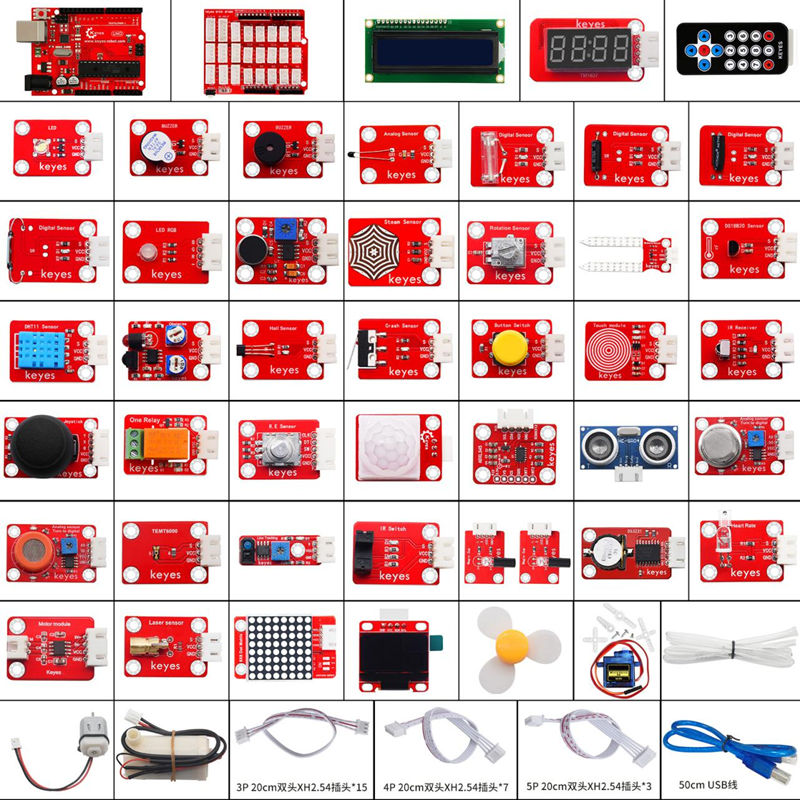

## 1.1 介绍

Keyes brick 42合一传感器套装主要包含常用的42款传感器/模块，还有对应的keyes UNO R3开发板、传感器扩展板和连接线。42款传感器/模块上都带有防反接口，和提供的传感器扩展板接口完全匹配。使用时，将传感器扩展板堆叠在keyes UNO R3开发板，利用1根自带的连接线将传感器/模块连接在扩展板上，简单方便。

为了对这个42款传感器/模块有更深入的了解，基于这个42款传感器/模块做个多个学习课程。这些课程是利用米思齐软件平台制作的，课程中提供了对应的接线方法、图形化编程代码、实验结果和简单的代码介绍等信息。通过这些课程，可以对编程方法、逻辑有了更深刻的理解。

## 1.2 清单

| 序号 | 名称                                                         | 数量 | 图片                                                         |
| ---- | ------------------------------------------------------------ | ---- | ------------------------------------------------------------ |
| 1    | keyes brick LED白发白模块(焊盘孔) 防反插白色端子             | 1    | 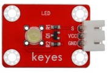                       |
| 2    | keyes brick 热敏电阻传感器(焊盘孔) 防反插白色端子            | 1    | 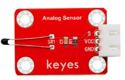                       |
| 3    | keyes brick 按键传感器(焊盘孔) 防反插白色端子（配黄帽）      | 1    | 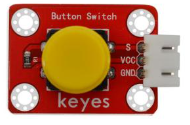                       |
| 4    | keyes brick 干簧管(焊盘孔) 防反插白色端子                    | 1    | 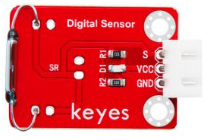                       |
| 5    | keyes brick 魔术光杯传感器(焊盘孔) 防反插白色端子            | 2    | 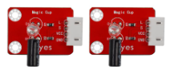                       |
| 6    | keyes brick DHT11温湿度传感器(焊盘孔) 防反插白色端子         | 1    | 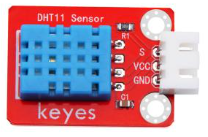                       |
| 7    | keyes brick 震动模块传感器(焊盘孔) 防反插白色端子            | 1    | 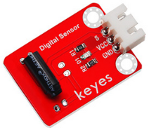                       |
| 8    | keyes brick 水滴水蒸气传感器(焊盘孔) 防反插白色端子          | 1    | 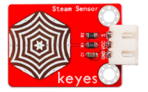 |
| 9    | keyes brick 倾斜模块传感器(焊盘孔) 防反插白色端子            | 1    | 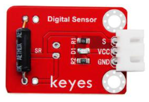                       |
| 10   | keyes brick 光折断传感器(焊盘孔) 防反插白色端子              | 1    |                        |
| 11   | keyes brick 手指测心跳模块(焊盘孔) 防反插白色端子            | 1    | 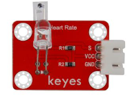                       |
| 12   | keyes brick ADXL345加速度传感器(焊盘孔) 防反插白色端子       | 1    | 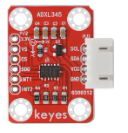                       |
| 13   | keyes brick 土壤传感器(焊盘孔) 防反插白色端子                | 1    | 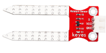                       |
| 14   | keyes brick 麦克风声音传感器(焊盘孔) 防反插白色端子          | 1    | 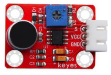                       |
| 15   | keyes brick 霍尔传感器(焊盘孔) 防反插白色端子                | 1    | 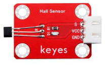                       |
| 16   | keyes brick 碰撞传感器(焊盘孔) 防反插白色端子                | 1    | 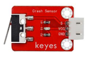                       |
| 17   | SG90 9G 23*12.2*29mm 配十字臂 蓝色 辉盛 180度 环保           | 1    | 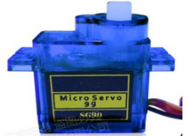                       |
| 18   | keyes brick HC-SR04超声波传感器 防反插白色端子               | 1    | 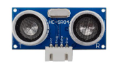                       |
| 19   | keyes brick 有源蜂鸣器模块焊盘孔) 防反插白色端子             | 1    | 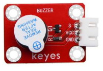                       |
| 20   | keyes brick MQ-2 烟雾传感器(焊盘孔) 防反插白色端子           | 1    | 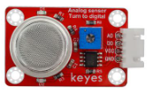                       |
| 21   | keyes brick 敲击模块传感器(焊盘孔) 防反插白色端子            | 1    | 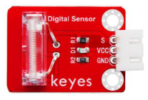                       |
| 22   | keyes brick 电容触摸传感器(焊盘孔) 防反插白色端子            | 1    | 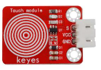                       |
| 23   | keyes brick 红外接收传感器(焊盘孔) 防反插白色端子            | 1    | 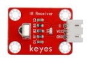                       |
| 24   | keyes brick 摇杆模块传感器(焊盘孔) 防反插白色端子（要配摇杆帽） | 1    | 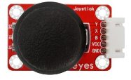                       |
| 25   | keyes brick 无源蜂鸣器模块(焊盘孔) 防反插白色端子            | 1    | 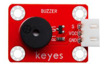                       |
| 26   | keyes brick MQ-3 酒精传感器(焊盘孔) 防反插白色端子           | 1    | 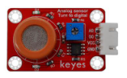                       |
| 27   | keyes brick 避障传感器(焊盘孔) 防反插白色端子                | 1    | 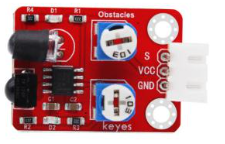                       |
| 28   | keyes brick TM1637 4位数码管模块(焊盘孔) 防反插白色端子      | 1    | 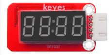                       |
| 29   | keyes brick 旋转编码器模块(焊盘孔) 防反插白色端子            | 1    | 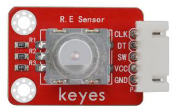                       |
| 30   | keyes brick 人体红外热释电传感器(焊盘孔) 防反插白色端子      | 1    | 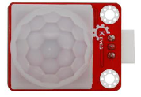                       |
| 31   | keyes brick 激光头传感器模块(焊盘孔) 防反插白色端子          | 1    | 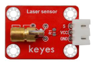                       |
| 32   | keyes brick 可调电位器模块(焊盘孔) 防反插白色端子            | 1    | 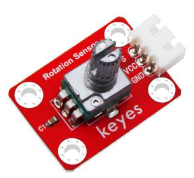                       |
| 33   | keyes brick 巡线传感器(焊盘孔) 防反插白色端子                | 1    | 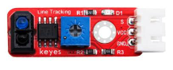                       |
| 34   | keyes brick 18B20温度传感器(焊盘孔) 防反插白色端子           | 1    | 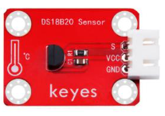                       |
| 35   | keyes brick TEMT6000光线传感器(焊盘孔) 防反插白色端子        | 1    | 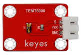                       |
| 36   | keyes brick 5V 单路继电器模块(焊盘孔) 防反插白色端子         | 1    | 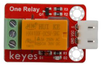                       |
| 37   | keyes brick 插件RGB模块(焊盘孔) 防反插白色端子               | 1    | 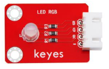                       |
| 38   | Keyes brick 8X8点阵模块(可选地址) 防反插白色端子             | 1    | 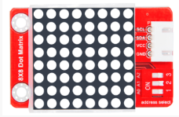                       |
| 39   | keyes brick IIC 1602 蓝屏（5V）防反插白色端子                | 1    | 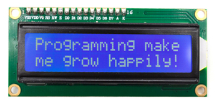                       |
| 40   | 0.96寸高亮高清晰 IIC通信 OLED模块 小OLED显示屏 蓝屏          | 1    | 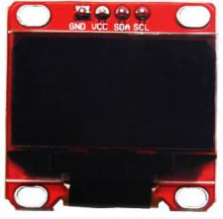                       |
| 41   | keyes brick 3231时钟模块(焊盘孔) 防反插白色端子              | 1    | 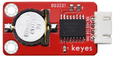                       |
| 42   | KEYES 130电机-DC3-5V浇花小水泵驱动模块                       | 1    | 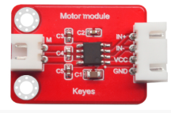                       |
| 43   | Keyes brick shield 传感器扩展板 防反插白色端子               | 1    | 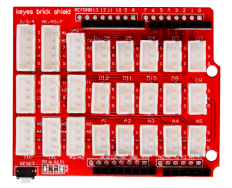                       |
| 44   | keyes UNO R3 for arduino 开发板 红色 环保                    | 1    | 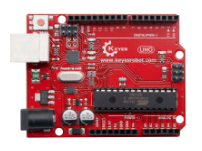                       |
| 45   | 3P 双头XH2.54插头 L=200mm 白色                               | 15   | 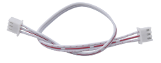                       |
| 46   | 4P 双头XH2.54插头 L=200mm 白色                               | 7    | 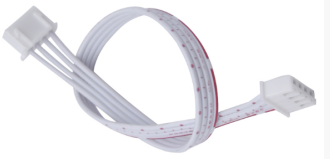                       |
| 47   | 5P 双头XH2.54插头 L=200mm 白色                               | 3    | 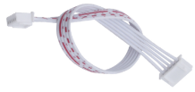                       |
| 48   | AM/BM 透明蓝 OD:5.0 L=50cm 环保                              | 1    | 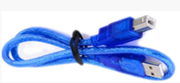                       |
| 49   | 透明绿 开口50*76*0.2MM 环保                                  | 40   | 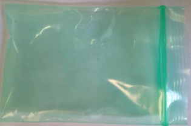                       |
| 50   | JMP-1 17键86*40*6.5MM 黑色                                   | 1    |                        |
| 51   | DC3-5V浇花小水泵+100MM连接线                                 | 1    | 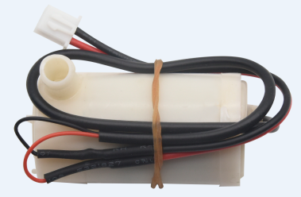                       |
| 52   | 浇花水管 内径6MM 外径8MM 1米                                 | 1    |                        |
| 53   | 130电机+100MM连接线                                          | 1    |                        |
| 54   | 桨参数：孔径2mm  转动直径：72mm  中间圆帽直径：24mm  叶片长:25mm  中间圆帽颜色：黄 环保 | 1    |                        |
| 55   | N-240 235*160*65MM 白色 环保                                 | 1    |                        |

## 1.3 介绍keyes UNO R3开发板

特写：

开发板的各个接口和主要元器件。

**芯片简介**

- 1 ATMEGA328P-AU

- 7 Atmega16U2 USB转串口芯片

- 9 AMS1117 5V稳压芯片

**接口简介**

2 ICSP接口: 给ATMEGA328P-AU烧录固件接口

3 数字口D0-D13

串口通信：D0(RX)和D1(TX)

外部中断：D2（中断0）和D3（中断1）

PWM口：D3、D5、D6、D9、D10和D11

SPI通信：D10(SS)、D11(MOSI)、D12(MISO)和D13(SCK)

LED:D13直接驱动标志“L”的LED

4 ICSP接口:  给Atmega16U2烧录固件接口

6 USB接口:  用于下载程序、串口调试和供电

10 DC电源接口:  可接入7V-12V范围内电压

11 电源输出接口: 输出3.3V或5V，常用于对外供电或进行共地处理

12 DC电源接口: 可接入7V-12V范围内电压

13 模拟口A0-A5

IIC通信：A4(SDA)和A5（SCL）,也可当做数字口使用：A0(D14)、A1(D15)、A2(D16)、A3(D17)、A4(D18)和A5(D19)

**器件简介**

- 5 复位按键

- 8 16 MHz晶