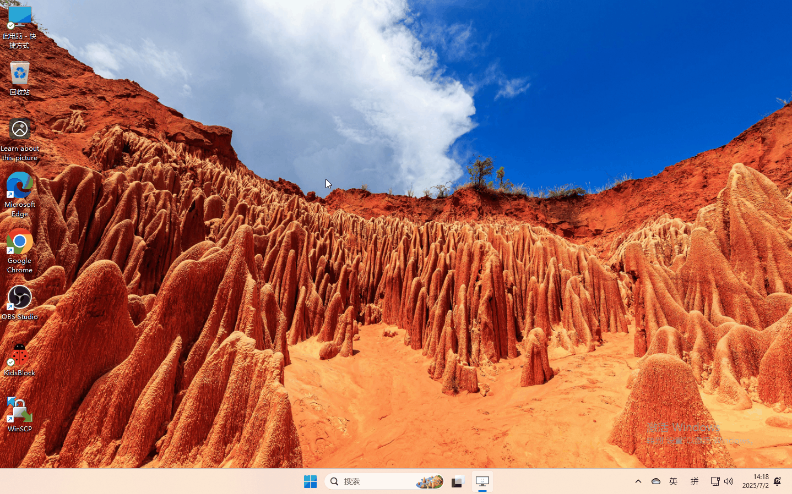
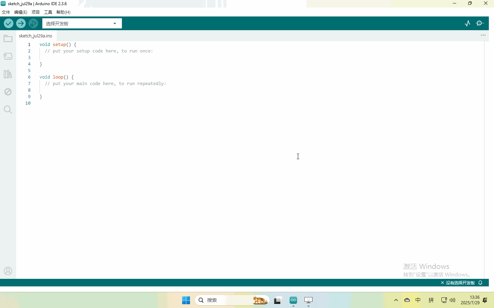
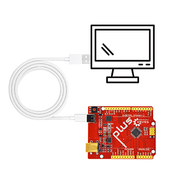
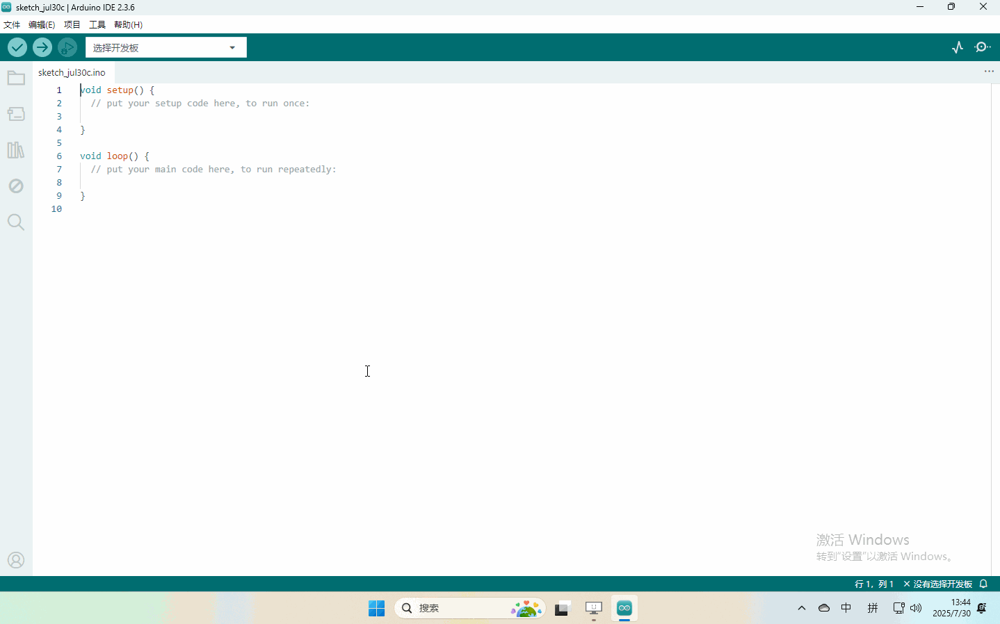

# 2. Arduino

## 2.1 资料下载

**Arduino资料包含库文件和项目代码，请先点击下载进行后续的学习！！！！**

下载：[Arduino](./Arduino.7z)

## 2.2 Windows系统

**软件下载与安装**

打开浏览器，搜索”https://www.arduino.cc/en/software”，操作如下：

**库文件的添加**

**解压4.1下载的Arduino资料**

## 2.3 Mac系统软件

**软件下载与安装**

打开浏览器，搜索”https://www.arduino.cc/en/software”，操作如下：

**库文件导入**

打开Arduino IDE,按照[项目]—>[导入库]—>[添加.zip库],该方法一次只能导入一个库文件，产品存在多个库请参照该过程依次导入！

## 2.4 上传第一个代码

上传代码前先将主板连接到电脑

由于软件在windows系统和Mac系统的界面一致，这里以Windows操作展示。

程序上传成功，开发板上的LED灯亮一秒钟，灭一秒钟！

**将开发板连接到电脑，按照[工具] —>[端口]选择开发板端口（注意：如果不能确认哪个端口是开发板的，请接上主板手机拍照记录全部端口，之后拔掉开发板重新拍照记录全部端口，对比找到消失的端口，拔掉主板后消失的端口就是开发板端口，后续选择该端口就行）**

至此，已经完成了Arduino IDE的软件安装、库文件导入等操作，请继续具体课程的学习。

## 2.5 项目

**单个传感器/模块实验课程**

拿到套件后，套件中有42款传感器/模块，有对应的keyes UNO R3开发板、传感器扩展板和连接线。42款传感器/模块是利用自带连接线，单独连接在keyes UNO R3开发板和传感器扩展板。然后上传对应的测试代码，单独测试各个传感器/模块的功能。

特别注意：实验时，模块/传感器连接线材时，必须按照资料里的接线方法及位置，电源与信息脚不能错接，否则会损坏模块/传感器。

**传感器/模块组合实验课程**

前面课程中，单独测试了传感器/模块的功能，功能比较单一。在此，将多个传感器/模块搭配使用，组合出各种各样的功能。传感器/模块种类比较多，以下选择几款比较经典的组合实验。也可以根据自己的想法，自己设置代码，组合出想要的特别的功能。