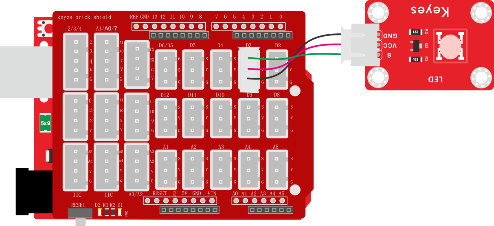

### 项目一 LED 模块测试

**1.实验说明**

在这个套件中，有一个keyes brick LED白发白模块。它的控制方法非常简单，控制时，GND VCC上电后；信号端S为高电平时LED亮起，S为低电平时LED熄灭。

实验中，提供两个测试代码，分别控制LED模块上实现闪烁和呼吸灯的效果。闪烁效果好理解；呼吸灯效果，就是控制LED模块上LED首先逐渐变亮，然后逐渐变暗，循环交替，如人体呼吸一样。

**2.实验器材**

- keyes brick LED白发白模块*1

- keyes UNO R3开发板*1

- 传感器扩展板*1

- 3P 双头XH2.54连接线*1

- USB线*1


**3.接线图**



**4.测试代码**

代码1

```
int ledPin = 3; //定义LED管脚接D3

void setup() 
{
  pinMode(3, OUTPUT);//设置模式为输出
}

void loop() 
{
  digitalWrite(3, HIGH); //输出高电平，点亮
  delay(1000);//延迟1000毫秒
  digitalWrite(3, LOW); //输出低电平，熄灭
  delay(1000);
}
```

代码2

```
int ledPin = 3; //定义LED引脚为D3

void setup() 
{
}

void loop() 
{
  for (int i = 0; i <= 255; i = i + 1) //逐渐变亮
  {
    analogWrite(ledPin, i);
    delay(10);
  }
  for (int i = 255; i >= 0; i = i - 1) //逐渐熄灭
  {
    analogWrite(ledPin, i);
    delay(10);
  }
}
```

**5.代码说明**

代码1说明：

1.  pinMode(pin,mode)；pin是用于设置模式的Arduino引脚号；mode为模式，可选：输入模式INPUT，输出模式OUTPUT或输入上拉INPUT_PULLUP，在这里我们设置了管脚3位输出模式。
2.  digitalWrite(pin,     value)；pin是单片机数字管脚，在这里我们定义了管脚3；value是你将要输出的数字电平（HIGH/LOW）；如果使用pinMode（）将引脚配置为OUTPUT，则其电压将设置为相应的值：5V（在3.3V板上为3.3V）为HIGH，低电平为0V（接地）。如果没有把pinMode（）设置为OUTPUT，而是将LED连接到引脚，则在调用digitalWrite（HIGH）时，LED可能会变暗。因为此时digitalWrite（）将启用内部上拉电阻，其作用类似于一个大限流电阻。
3.  delay(ms)；延时函数，ms为暂停的毫秒数，数据类型：unsigned     long（范围 0~ 4,294,967,295 (2^32 - 1)）。
4.  通过整合前面知识。我们再来看代码就清楚明了了，代码中第一条我们把模块信号端接到D3，设置为高电平，就是点亮模块上LED；第二条延迟1000毫秒，就是让模块上LED点亮1秒。同样第三条第四条代码表示让模块上LED熄灭1秒。代码默认循环，也就是控制模块上LED，循环亮1秒，灭1秒，实现闪烁效果。通过代码设置，我们可以更改模块上LED亮灭的延迟时间，从而使模块上LED实现不同的闪烁效果。

代码2说明:

1.  代码中setup（）是只执行一次，而loop（）函数是一直循环。这里我们还用到了for（）循环：最简单形式为for(     ; ; )，我们在此实验中用到for (int i = 0; i \<= 255; i = i +1)；表示变量i从0到255，每次自加1，知道不满足 i \<=255这个判断表达式，否则一直执行大括号里的代码，即一共执行256次大括号里的代码；同理for     (int i = 255; i \>= 0; i = i - 1)；i每次自减1，当不满足i\>=0时，跳出该for（）循环，一共执行256次。
2.  代码1中，我们控制模块上信号端控制LED亮灭。在代码2中，我们通过利用keyes     UNO R3开发板上PWM口，设置PWM值，控制模块上LED亮度。
3.  keyes UNO R3开发板上只有D3 D5 D6 D9 D10     D11数字口是PWM口，也就是说如果要控制LED的亮度，信号端就只能接着几个接口。实验中，我们将模块信号端接在D3脚，属于PWM口。设置时我们设置PWM数值越小，模块上LED越暗，数值越大，模块上LED越亮，范围为0-255。analogWrite（pin，value），pin为PWM口，value是要输出的PWM值（0~255）。
4.  通过整合前面知识，我们再来看代码，就清楚多了。将D3的PWM值设置为i，i刚开始由0增加到255，每次加1，每加一次延迟10毫秒，模块上LED逐渐变亮。PWM为255后，i开始由255减小到0，每次减1，每减一次延迟10毫秒，模块上LED逐渐变暗。然后又逐渐变亮，循环交替，如人体呼吸一样。
5.  如果我们感觉逐渐变亮或者逐渐变暗的时间过长，我们可以更改代码设置。有两种方法，一种是将每次加1减1的延迟时间降低；另一种是更改步长，注意这个步长必须能被255整除，如3     5。步长改为3 -3代表i每次增加3或减小3。