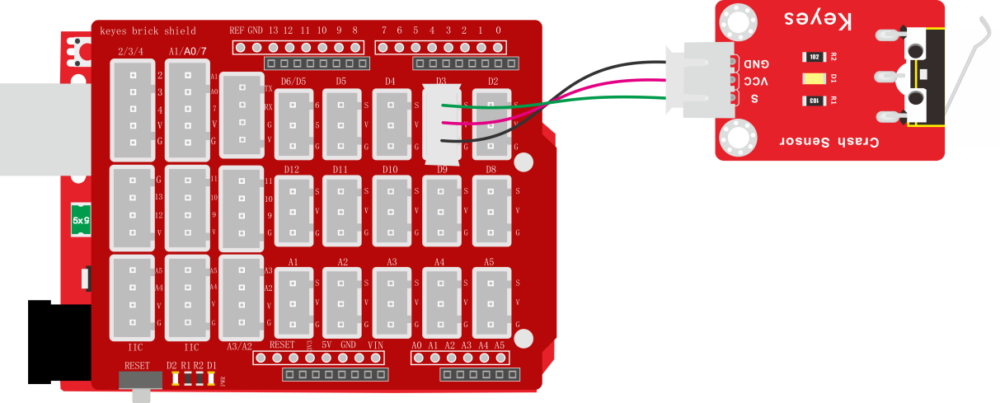
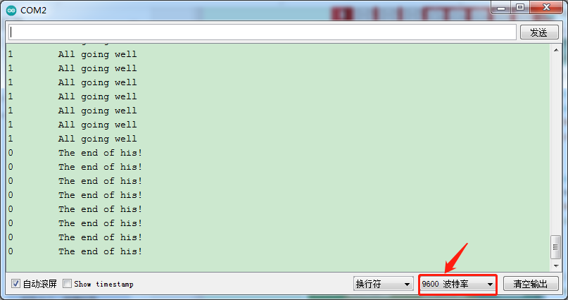

### 项目十二 碰撞检测

**1.实验说明**

在这个套件中，有一个keyes brick碰撞传感器，它主要采用1个轻触开关。当物体碰到轻触开关弹片，下压时，传感器信号端为低电平，自带D1 LED亮起；否则传感器信号端为高电平，自带D1 LED熄灭。该传感器常用于3D打印机内做限位开关。

实验中，我们通过读取模块上S端高低电平，判断传感器弹片是否下压；并且在串口监视器上显示测试结果。

**2.实验器材**

- keyes brick 碰撞传感器*1

- keyes UNO R3开发板*1

- 传感器扩展板*1

- 3P双头XH2.54连接线*1

- USB线*1


**3.接线图**



**4.测试代码**

```
int val = 0;

void setup() 
{
  Serial.begin(9600);//设置波特率为9600
  pinMode(3, INPUT);//设置输入模式
}

void loop() 
{
  val = digitalRead(3);//读取传感器的值
  Serial.print(val);//打印出来
  if (val == 0) //碰撞到了
  {
    Serial.print("        ");
    Serial.println("The end of his!");
    delay(100);
  }
  else //没碰撞
  {
    Serial.print("        ");
    Serial.println("All going well");
    delay(100);
  }
}
```

**5.测试结果**

上传测试代码成功，利用USB线上电后，打开串口监视器，设置波特率为9600。串口监视器显示对应数据和字符。实验中，传感器上弹片下压时，val为0，串口监视器显示“The end of his!”字符；当松开弹片时，val为1，串口监视器显示“All going well!”字符，如下图。

