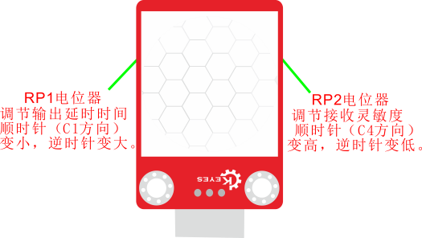
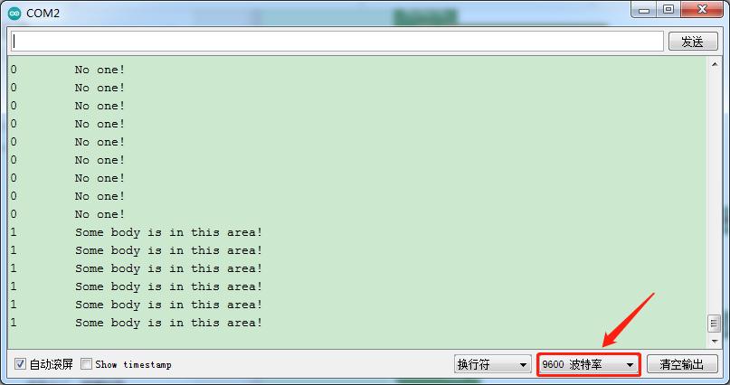

### 项目十三 附近有人吗

**1.实验说明**

在这个套件中，有一个keyes brick人体红外热释电传感器，它是一款基于热释电效应的人体热释运动传感器，能检测到人体或动物身上发出的红外线，配合菲涅尔透镜能使传感器探测范围更远更广。它主要采用RE200B-P传感器元件。

实验中，通过读取模块上S端高低电平，判断附近是否有人在运动；并且在串口监视器上显示测试结果。

**2.实验器材**

- keyes brick人体红外热释电传感器*1

- keyes UNO R3开发板*1

- 传感器扩展板*1

- 3P双头XH2.54连接线*1

- USB线*1


**3.接线图**

注：传感器自带2个电位器用于调节延迟时间和接收灵敏度，方法如下图。




**4.测试代码**

```
int val = 0;

void setup() 
{
  Serial.begin(9600);//设置波特率为9600
  pinMode(3, INPUT);//设置输入模式
}

void loop() 
{
  val = digitalRead(3);//读取传感器的值
  Serial.print(val);//打印值
  if (val == 1) //附近有人输出高电平
  {
    Serial.print("        ");
    Serial.println("Some body is in this area!");
    delay(100);
  }
  else //没人则输出低电平
  {
    Serial.print("        ");
    Serial.println("No one!");
    delay(100);
  }
}
```

**.测试结果**

上传测试代码成功，利用USB线上电后，打开串口监视器，设置波特率为9600。

串口监视器显示对应数据和字符。实验中，传感器检测到附近有人在运动时，val为1，串口监视器显示“Somebody is in this area!”字符；没有检测到人运动时，val为0，串口监视器显示“No one!”字符，如下图。

