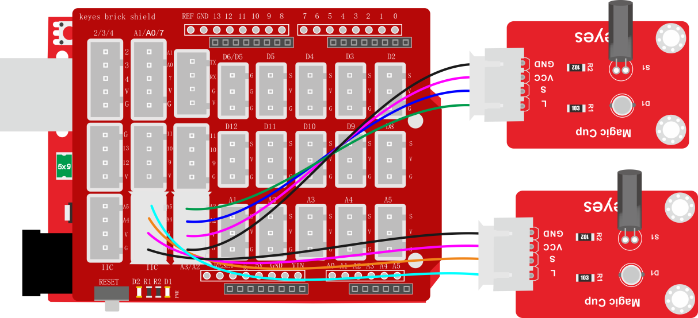
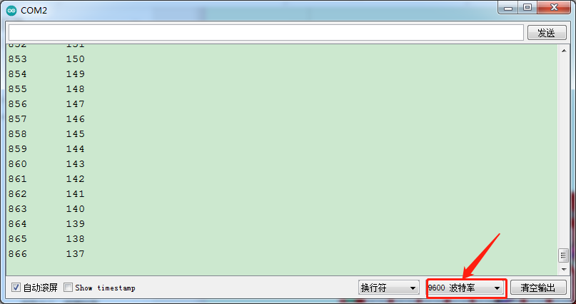

### 项目十六 魔术光杯传感器

**1.实验说明**

在这个套件中，有两个keyes brick魔术光杯传感器，它的原理是利用PWM调光的原理，两个传感器的亮度发生变化。滚珠开关提供数字信号，触发PWM的调节，通过程序的设计，可以看到类似于两组装满光的杯子倒来倒去的效果了。

实验中，通过读取传感器上S端高低电平，判断传感器的倾斜方向，然后控制传感器上LED的亮度变化（调节L端的PWM值）。

**2.实验器材**

- keyes brick魔术光杯传感器\*2

- keyes UNO R3开发板*1

- 传感器扩展板*1

- 4P双头XH2.54连接线\*2

- USB线*1


**3.接线图**



**4.测试代码**

```
int buttonStateA = 0;//模块1的状态
int buttonStateB = 0;//模块2的状态
int brightnessA = 0;//模块1的亮度
int brightnessB = 1000;//模块2的亮度
int sensor1=A2,sensor2=A4;//模块1传感器接A2，模块2传感器接A4
int led1=A3,led2=A5;//模块1led接A3，模块2led接A5

void PWMA(int val1) //输出模拟值val
{
  for (int i = 1; i <= 5; i = i + 1) 
  {
    digitalWrite(led1, HIGH);
    delayMicroseconds(val1);
    digitalWrite(led1, LOW);
    delayMicroseconds(1000 - val1);
  }
}

void PWMB(int val2) //输出模拟值val2
{
  for (int i = 1; i <= 5; i = i + 1) 
  {
    digitalWrite(led2, HIGH);
    delayMicroseconds(val2);
    digitalWrite(led2, LOW);
    delayMicroseconds(1000 - val2);
  }
}

void setup() 
{
  Serial.begin(9600);//设置波特率为9600
  pinMode(sensor1, INPUT);//传感器1输入模式
  pinMode(led1,OUTPUT);//LED1输出模式
  pinMode(sensor2, INPUT);//传感器2输入模式
  pinMode(led2,OUTPUT);//LED2输出模式
}

void loop() 
{
  buttonStateA = digitalRead(sensor1);//读取传感器1的转态
  buttonStateB = digitalRead(sensor2);//读取传感器2的转态
  if (buttonStateA == 1 && brightnessA != 1000) //如果传感器1的转态为1，但亮度不到1000
  {
    brightnessA = brightnessA + 1;//变亮
  } 
  else if (buttonStateA == 0 && brightnessA != 0) 
  {//如果传感器1的转态为0，但亮度不到0
    brightnessA = brightnessA - 1;//变暗
  }
  
  if (buttonStateB == 1 && brightnessB != 0) 
  {//如果传感器2的转态为1，但亮度不到0
    brightnessB = brightnessB - 1;//变暗
  }
  else if (buttonStateB == 0 && brightnessB != 1000) //如果传感器2的转态为0，但亮度不到1000
  {
    brightnessB = brightnessB + 1;//变亮
  }
  //打印出两个模块的亮度值
  Serial.print(brightnessA);
  Serial.print("      ");
  Serial.println(brightnessB);
  
  if (brightnessA == 0) //当LED1亮度为0
  {
    digitalWrite(led1, LOW);//熄灭
  } 
  else if (brightnessA == 1000) //当LED1亮度为1000
  {
    digitalWrite(led1, HIGH);//最亮
  } 
  else if (buttonStateA > 0 && brightnessA < 1000) //否则亮度在中间的话
  {
    PWMA(brightnessA);//输出模拟值
  }
  //下同
  if (brightnessB == 0) 
  {
    digitalWrite(led2, LOW);
  } 
  else if (brightnessB == 1000) 
  {
    digitalWrite(led2, HIGH);
  } 
  else if (brightnessB > 0 && brightnessB < 1000) 
  {
    PWMB(brightnessB);
  }
}
```

**5.代码说明**

1.  PWMA（）子程序，，模拟PWM口的PWM值，设置方波，设置高低电平延迟时间总共为1000微妙，即周期为1毫秒，频率是1000Hz。设置是PWM值就相当于设置方波时高电平的延迟时间（val1和val2）。

2.  delayMicroseconds(us)，延时函数，与delay（）不同的是，该函数参数us为微秒，代表延迟微秒数。

3.  设置程序逻辑如下表格

| 条件                                                    | 设置                                              |
| ------------------------------------------------------- | ------------------------------------------------- |
| 数字口A2（buttonStateA）为高电平并且brightnessA不是1000 | brightnessA设置为brightnessA加1（最大1000）       |
| 数字口A2（buttonStateA）为低电平并且brightnessA不是0    | brightnessA设置为brightnessA减1（最小0）          |
| 数字口A4（buttonStateB）为高电平并且brightnesB不是0     | brightnessB设置为brightnessB减1（最小0）          |
| 数字口A4（buttonStateB）为低电平并且brightnessB不是1000 | brightnessB设置为brightnessB加1（最大1000）       |
| brightnessA为0                                          | 设置数字口A3为低电平                              |
| brightnessA为1000                                       | 设置数字口A3为高电平                              |
| brightnessA大于0且小于1000                              | 利用数字口A3模拟PWM口，设置A3的PWM值为brightnessA |
| brightnessB为0                                          | 设置数字口A5为低电平                              |
| brightnessB为1000                                       | 设置数字口A5为高电平                              |
| brightnessB大于0且小于1000                              | 利用数字口A5模拟PWM口，设置A5的PWM值为brightnessB |

**6.测试结果**

上传测试代码成功，利用USB线上电后，打开串口监视器，设置波特率为9600。将两个魔术光杯传感器同时倾斜一边，一个魔术光杯上的LED逐渐变暗，同时另一个逐渐变亮，最终一个LED完全熄灭，一个LED最亮；在串口监视器中看到对应具体数值变化，如下图。当倾斜另一边中，现象一样，方向相反。

