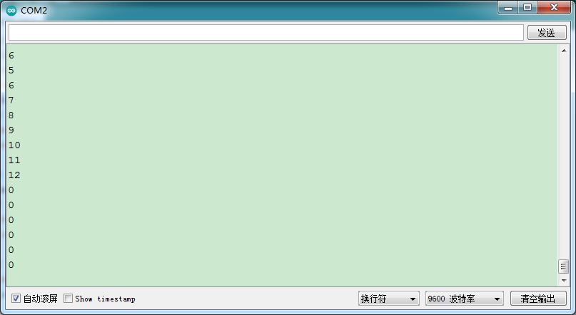

### 项目十八 旋转编码器模块计数

**1.实验说明**

在这个套件中，有一个keyes brick旋转编码器模块，它主要采用20脉冲旋转编码器元件。它可通过旋转计数正方向和反方向转动过程中输出脉冲的次数，这种转动计数是没有限制的，复位到初始状态，即从0开始计数。如果只计算信号的脉冲，则可以使用两个输出中的任何一个来确定旋转位置。但是，如果想要确定旋转方向，需要同时考虑两个信号。

实验中，利用keyes brick旋转编码器模块用于计数，当顺时针旋转编码器时，设置数据i加1；逆时针旋转编码器时，设置数据i减1；按下编码器中间按键时，设置数据i为0；将测试结果在串口监视器上显示。

**2.实验器材**

- keyes brick 旋转编码器模块*1

- keyes UNO R3开发板*1

- 传感器扩展板*1

- 5P双头XH2.54连接线*1

- USB线*1


**3.接线图**


**4.测试代码**

```
#include <Encoder.h>//导入编码器的库
int item = 0;
int old = 0;
Encoder encoder(2, 3);
int button = 4;

void setup() 
{
  Serial.begin(9600);//设置波特率
  pinMode(button, INPUT);//按键为输入模式
}

void loop() 
{
  item = encoder.read();//读取编码器的值赋给item
  if (digitalRead(button) == 0) //如果按键按下
  {
    Serial.println(digitalRead(button));//打印按键值
    delay(100);
  }
  if (old != item) //与之前读取的值不一样
  {
    Serial.println(item);//打印编码器的值
    old = item;
  }
}
```

**5.测试结果**

上传测试代码成功，利用USB线上电后，打开串口监视器，设置波特率为9600。顺时针旋转编码器，显示数据减小；逆时针旋转编码器，显示数据增加；按下编码器中间按键，显示数据为0，如下图。

