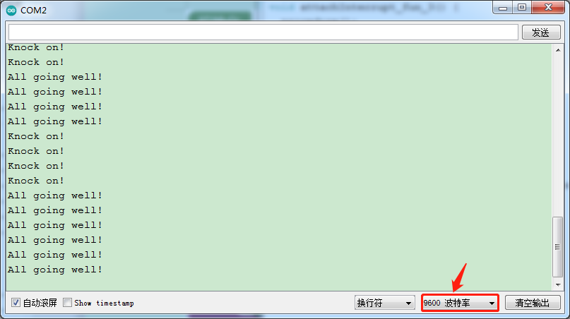

### 项目十九 敲击模块传感器检测状态

**1.实验说明**

在这个套件中，有一个敲击模块传感器，它主要采用SW-2802振动开关元件。SW-2802振动开关元件是弹簧型震动感应触发开关。该振动开关在静止時为开路OFF状态，当受到外力碰触而达到相应震动力时,或移动速度达到适当离(偏)心力时，导电接脚会产生瞬间导通呈瞬间ON状态;当外力消失時,开关恢复为开路OFF状态。该传感器就是利用元件这一特性，搭建电路将震动信号转换为高低电平变换信号。

实验中，利用敲击模块传感器检测敲击状态，将测试结果在串口监视器上显示。

**2.实验器材**

- keyes brick 敲击模块传感器*1

- keyes UNO R3开发板*1

- 传感器扩展板*1

- 3P 双头XH2.54连接线*1

- USB线*1


**3.接线图**


**4.测试代码**

```
void attachInterrupt_fun_3() 
{ //中断服务函数
  procedure();
}

void procedure() 
{
  Serial.println("Knock on!");//触发中断打印"Knock on!"
  delay(100);
}

void setup()
{
  Serial.begin(9600);//设置波特率为9600
  pinMode(3, INPUT_PULLUP);//引脚3配置为输入上拉模式
  attachInterrupt(digitalPinToInterrupt(3),attachInterrupt_fun_3,FALLING);//中断引脚为D3，下降沿触发
}

void loop()
{
  Serial.println("All going well!");
  delay(200);
}
```

**5.代码说明**

1.  在这一实验中，主要接触到的新知识是中断知识。keyes UNO  R3开发板的中断口是数字口2和数字口3，把信号端设置在数值口3了。
2.  pinMode(pin, INPUT_PULLUP);这条代码的意思是配置管脚pin为输入上拉，之前我们说到配置为输入模式时，引脚的电平是悬浮状态，是不确定的，当我们设置为输入上拉模式时，电平处于确定的，高电平状态，除非我们改变它。
3.  attachInterrupt(digitalPinToInterrupt(pin), ISR,  mode)的第一个参数是中断号。通常使用digitalPinToInterrupt（pin）将实际的数字引脚转换为特定的中断号。例如连接到引脚3，则使用digitalPinToInterrupt（3）作为attachInterrupt（）的第一个参数。ISR为中断服务程序，是中断发生时调用的函数。Mode为出发中断模式，使用的UNO  R3开发板有四种触发中断模式：
    - LOW：引脚为低电平时触发；
    - CHANGE:引脚电平改变时触发；
    - RISING：上升沿触发即电平由低变高时触发；
    - FALLING：下降沿触发即电平由高变低时触发。

这里使用了FALLING。

**6.测试结果**

上传测试代码成功，利用USB线上电后，打开串口监视器，设置波特率为9600。当传感器敲击信号时，传感器监视器显示“Knock on!”字符；否则显示“All going well!”字符，如下图。

