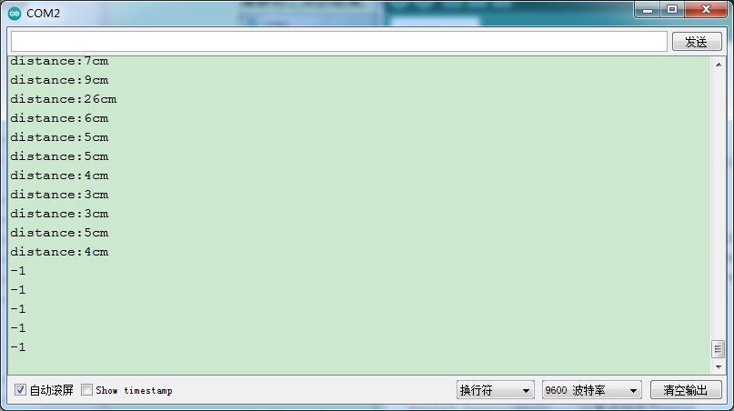

### 项目二十 超声波测距

**1.实验说明**

在这个套件中，有一个HC-SR04超声波传感器，它可以检测前方是否存在障碍物，并且检测出传感器与障碍物的详细距离。它的原理和蝙蝠飞行的原理一样，就是超声波模块发送出一种频率很高，人体无法听到的超声波信号。这些超声波的信号若是碰到障碍物，就会立刻反射回来，在接收到返回的信息之后，通过判断发射信号和接收信号的时间差，计算出传感器和障碍物的距离。

实验中，利用传感器检测传感器和障碍物之间的距离，将测试结果在串口监视器上显示。

**2.实验器材**

- keyes brick HC-SR04超声波传感器*1

- keyes UNO R3开发板*1

- 传感器扩展板*1

- 4P 双头XH2.54连接线*1

- USB线*1


**3.接线图**


**4.测试代码**

```
int distance = 0; //定义一个用来接收距离的变量
int EchoPin = 13; //Echo引脚接D13
int TrigPin = 12; //Trig引脚接D12

float checkdistance()  //获取距离
{
  // Give a short LOW pulse beforehand to ensure a clean HIGH pulse:
  digitalWrite(TrigPin, LOW);
  delayMicroseconds(2);
  // The sensor is triggered by a HIGH pulse of 10 or more microseconds.
  digitalWrite(TrigPin, HIGH);
  delayMicroseconds(10);
  digitalWrite(TrigPin, LOW);
  // Read the signal from the sensor: a HIGH pulse whose
  // duration is the time (in microseconds) from the sending
  // of the ping to the reception of its echo off of an object.
  float distance = pulseIn(EchoPin, HIGH) / 58.00;
  delay(10);
  return distance;
}

void setup() 
{
  Serial.begin(9600);//设置波特率为9600
  pinMode(TrigPin, OUTPUT);//Trig引脚为输出
  pinMode(EchoPin, INPUT);  //Echo引脚为输入
}

void loop() 
{
  distance = checkdistance();
  if (distance < 2 || distance >= 400) //在范围外打印"-1"
  {
    Serial.println("-1");
    delay(100);
  }
  else   //打印距离，单位厘米
  {
    Serial.print("distance:");
    Serial.print(distance);
    Serial.println("cm");
    delay(100);
  }
}
```

**5.代码说明**

HC-SR04超声波传感器最大测试距离为3-4m，最小测试距离为2cm。设置代码当检测距离小于2cm或者大于等于400cm时，串口监视器显示-1。在电脑的串口监视器中显示除传感器和障碍物之间的距离。

**6.测试结果**

上传测试代码成功，利用USB线上电后，打开串口监视器，设置波特率为9600。如果障碍物在测试范围外，串口监视器显示“-1”；否则，串口监视器显示超声波传感器和前方障碍物之间的距离，单位为cm，如下图。

