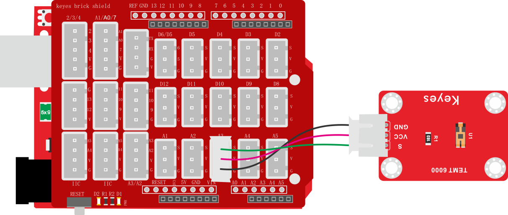
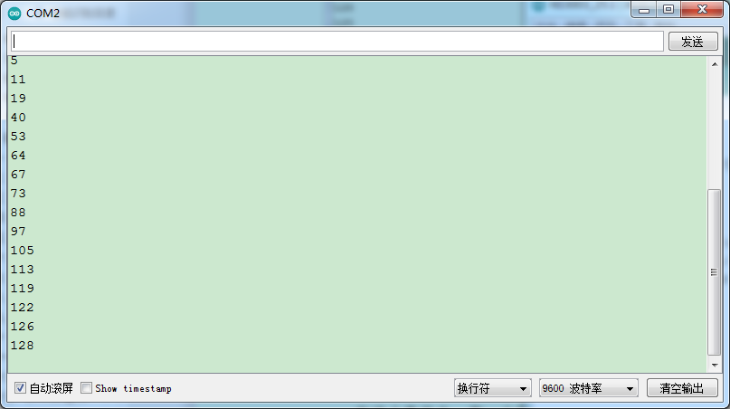

### 项目二十五 TEMT6000光线传感器

**1.实验说明**

在这个套件中，有一个keyes brick TEMT6000光线传感器，它主要采用TEMT6000X01元件。该元件是一个高灵敏可见光光敏（NPN型）三极管。传感器可以将捕获的微小光线变化并放大100倍左右，并且轻松的被微控制器识别，进行AD转换。它对可见光照度的反应特性与人眼的特性类似，可以模拟人对环境光线的强度的判断，从而方便做出与人友好互动的应用。

实验中，利用这个传感器测试当前环境中的光照强度对应的模拟值，光照越强，模拟值越大；并且在串口监视器上显示测试结果。

**2.实验器材**

- keyes brick TEMT6000光线传感器*1

- keyes UNO R3开发板*1

- 传感器扩展板*1

- 3P双头XH2.54连接线*1

- USB线*1


**3.接线图**



**4.测试代码**

```
volatile int item = 0;

void setup() 
{
  Serial.begin(9600);//设置波特率
}

void loop() 
{
  item = analogRead(A3);//读取传感器器的值
  Serial.println(item);//打印值
  delay(100);//延时100MS
}
```

**5.代码说明**

设置方法和实验二十四类似。

**6.测试结果**

烧录好测试代码，按照接线图连接好线，利用USB线上电后，打开软件串口监视器，设置波特率为9600，可以看到对应光照强度的模拟值，光照越强，模拟值越大，如下图。



