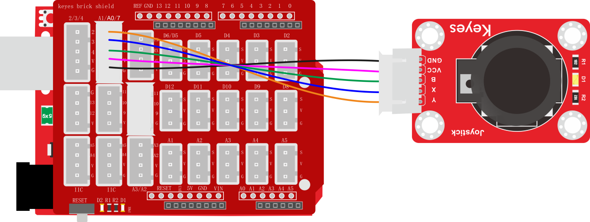
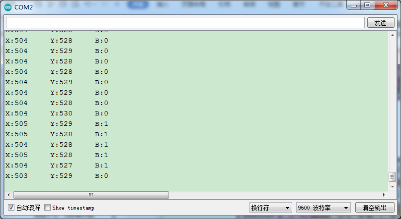

### 项目三十 摇杆模块传感器

**1.实验说明**

在这个套件中，有一个keyes brick 摇杆模块传感器，它主要采用PS2手柄摇杆元件。控制时，需要将模块X Y端口连接单片机模拟口，B端口连接单片机数字口，VCC接单片机电源输出端（3.3-5V），GND接单片机GND。可以读取两个模拟值和一个数字口的高低电平情况，判断模块上摇杆的工作状态。

实验中，将读取两个模拟值和一个数字值，并在串口监视器上显示测试结果。

**2.实验器材**

- keyes brick 摇杆模块传感器*1

- keyes UNO R3开发板*1

- 传感器扩展板*1

- 5P双头XH2.54连接线*1

- USB线*1


**3.接线图**



**4.测试代码**

```
volatile int X = 0;
volatile int Y = 0;
volatile int Button = 0;

void setup() 
{
  Serial.begin(9600);
  pinMode(7, INPUT);//定义按键的PIN为数字口7
}

void loop() 
{
  X = analogRead(A0);
  Y = analogRead(A1);
  Button = digitalRead(7);
  Serial.write("X:");
  Serial.print(X);
  Serial.write("     Y:");
  Serial.print(Y);
  Serial.write("     B:");
  Serial.println(Button);
  delay(100);
}
```

**5.代码说明**

在实验中，根据接线，x管脚设置为A0，y管脚设置为A1，摇杆按钮管脚设置为7，串口监视器显示测试数据，显示前需设置波特率（默认设置为9600，可更改）。

**6.测试结果**

上传测试代码成功，利用USB线上电后，打开串口监视器，设置波特率为9600。串口监视器显示对应数值。摇动摇杆，x轴和y轴对应的模拟值发生改变，按下按钮，读取到的数字值为1，否则为0，如下图。

