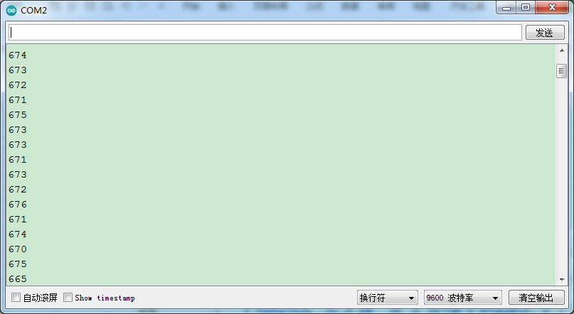
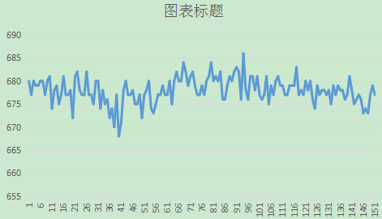

### 项目三十一 手指测心跳模块

**1.实验说明**

在这个套件中，有一个手指测心跳模块，它主要由1个光敏接收器和1个红外发射器组成。红外发射器在手指的一面，光敏接收器在手指的另一面；光敏接收器用来获取发射的光通量；当血压脉动通过手指时，光敏接收器的电阻会用微小的变化。

使用时，提供该模块和arduino系列单片机搭配使用的方法。**测试时，特别需要注意，需要用黑布包裹模块和手指，确保在无光环境中测试，否则测试不准确。**

实验中，将测试得到是数据，复制到Excel上，并生成相应的图片。

**2.实验器材**

- keyes brick 手指测心跳模块*1

- keyes UNO R3开发板*1

- 传感器扩展板*1

- 3P 双头XH2.54连接线*1

- USB线*1


**3.接线图**


**4.测试代码**

```
int sensorPin = A3; // 传感器的引脚为A3

void setup() 
{
  Serial.begin(9600);//设置波特率为9600
}

void loop() 
{
  int value = analogRead(A3); //读取模拟值
  Serial.println(value);//打印出来
}
```

**5.代码说明**

将管脚设置为A3，将所测数据用串口监视器打印出来。

**6.测试结果**

烧录好测试代码，按照接线图连接好线；利用USB接口上电后，进入串口监视器，设置波特率为9600。用，用手指按住光敏接收器，用黑布包裹模块和手指。串口监视器显示对应数据，如下图。



等待一会，将串口监视器数据复制到excel上，生成对应图片，如下图。

