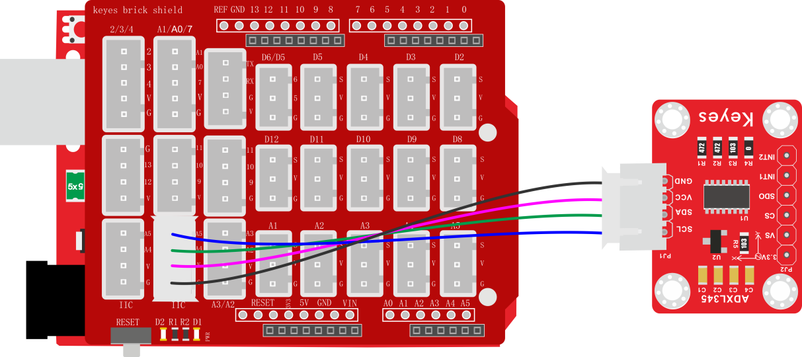
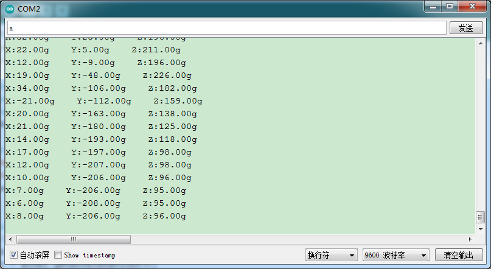

### 项目三十二 ADXL345加速度传感器

**1.实验说明**

在这个套件中，有一个keyes brick ADXL345加速度传感器，它采用ADXL345BCCZ芯片。ADXL345BCCZ是一款小而薄的低功耗3轴加速度计，分辨率高（13位），测量范围达±16g。它数字输出数据为16位二进制补码格式，可通过SPI（3线或4线）或I2C数字接口访问。该传感器非常适合移动设备应用。它可以在倾斜检测应用中测量静态重力加速度，还可以测量运动或冲击导致的动态加速度。其高分辨率(4mg/LSB)，能够测量不到1.0°的倾斜角度变化。

实验中，测试出传感器X Y Z轴的加速度数值；并且在串口监视器上显示测试数据。

**2.实验器材**

- keyes brick ADXL345加速度传感器*1

- keyes UNO R3开发板*1

- 传感器扩展板*1

- 4P双头XH2.54连接线*1

- USB线*1


**3.接线图**



**4.测试代码**

```
#include <Wire.h>
#include <I2Cdev.h>
#include <ADXL345.h>  //ADXL345的库

float X = 0;
float Y = 0;
float Z = 0;
ADXL345 accel;

void setup() 
{
  Serial.begin(9600);
  Wire.begin();
  accel.initialize(); //初始化
}

void loop() 
{
  //读取加速度值
  X = accel.getAccelerationX();
  Y = accel.getAccelerationY();
  Z = accel.getAccelerationZ();
  //打印加速度值
  Serial.print("X:");
  Serial.print(X);
  Serial.print("g    Y:");
  Serial.print(Y);
  Serial.print("g    Z:");
  Serial.print(Z);
  Serial.println("g");
  delay(100);
}
```

**5.代码说明**

设置3个小数变量X Y Z，将所测结果赋值给X Y Z。串口监视器显示X Y Z的值，显示前需设置波特率（默认设置为9600，可更改）。

**6.测试结果**

上传测试代码成功，利用USB线上电后，打开串口监视器，设置波特率为9600。串口监视器显示传感器对应的X Y Z的值，单位为g，如下图。

