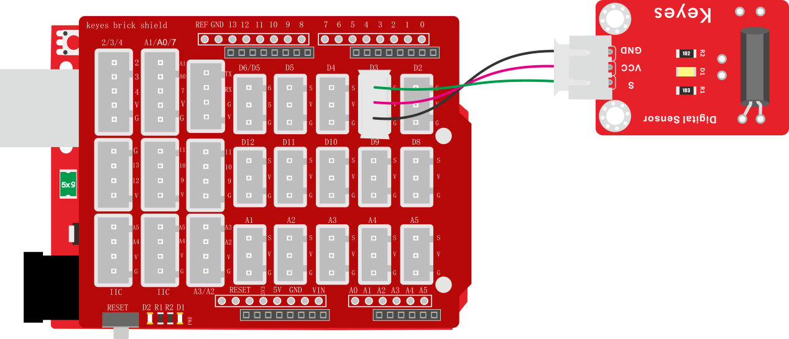
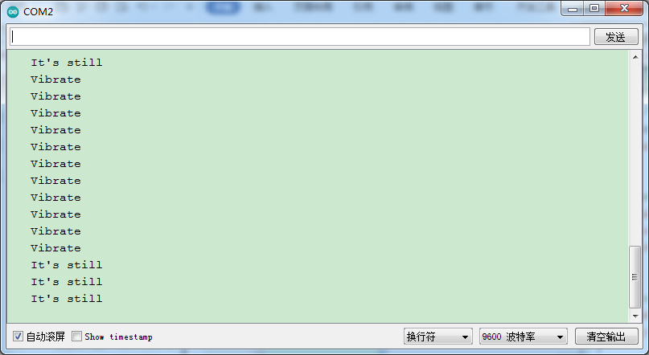

### 项目三十三 震动模块传感器

**1.实验说明**

这是一个常用的震动模块传感器。它具有无方向性特性，任何角度均可以触发工作，完全密封式封装可以防水、防尘，适用于小电流电路的触发。

传感器接上电源后，在静止时为开路（OFF）状态，信号端输出为高电平，传感器上LED变暗；当受到外力碰触而达到适当震动力时，或移动速度达到适当离（偏）心力时，导电接脚会发生瞬间导通（ON）状态，使电气特性改变，信号端输出为低电平，传感器上LED变亮；而当外力消失时电气特性恢复开路（OFF）状态。

传感器上兼容各种单片机控制板，如arduino系列单片机。使用时，可以在单片机上堆叠一个传感器扩展板。传感器上模块和自带导线连接，然后连接在传感器扩展板上，简单方便。同时，传感器自带2个直径为3mm的定位孔，方便你将传感器固定在其他设备。

实验中，通过读取传感器上S端高低电平，判断传感器是否震动；并且在串口监视器上显示测试结果。

**2.实验器材**

- keyes brick震动模块传感器*1

- keyes UNO R3开发板*1

- 传感器扩展板*1

- 3P双头XH2.54连接线*1

- USB线*1


**3.接线图**



**4.测试代码**

```
void attachInterrupt_fun_3() 
{  //中断服务程序
  Serial.println("   Vibrate");
}

void setup() 
{
  Serial.begin(9600);//波特率为9600
  pinMode(3, INPUT_PULLUP);//输入上拉
  attachInterrupt(digitalPinToInterrupt(3), attachInterrupt_fun_3, FALLING); //下降沿触发
}

void loop() 
{
  Serial.println("   It's still");  //循环打印
  delay(100);
}
```

**5.测试结果**

烧录好测试代码，按照接线图连接好线，上电后，打开串口监视器，设置波特率为9600。当传感器每检测到一次震动时，串口监视器打印Vibrate，否则打印It's still。

