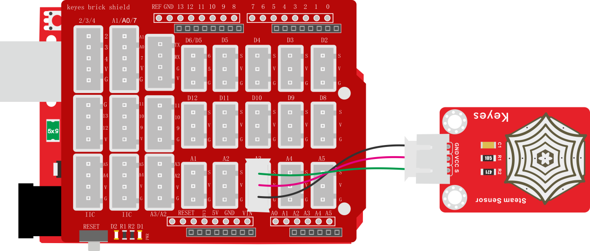
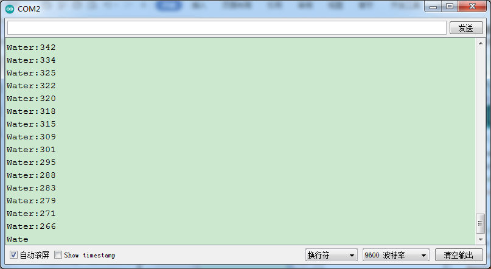

### 项目三十四 水滴水蒸气传感器

**1.实验说明**

这是一个常用的水滴水蒸气传感器。它的原理是通过电路板上裸露的印刷平行线检测水量的大小。水量越多，就会有更多的导线被联通，随着导电的接触面积增大，输出的电压就会逐步上升。除了可以检测水量的大小，它还可以检测空气中的水蒸气。

同时，传感器自带2个直径为3mm的定位孔，方便将传感器固定在其他设备。

实验中，将传感器信号端(S端)输入到arduino系列单片机的模拟口，感知模拟值的变化，并在串口监视器上显示出对应的模拟值。

**2.实验器材**

- keyes brick 水滴水蒸气传感器*1

- keyes UNO R3开发板*1

- 传感器扩展板*1

- 3P双头XH2.54连接线*1

- USB线*1


**3.接线图**



**4.测试代码**

```
int item = 0;
int Water = A3; //水蒸气传感器的PIN为A3

void setup() 
{
  Serial.begin(9600);//设置波特率为9600
}

void loop() 
{
  item = analogRead(A3);  //读取水蒸气传感器的值
  Serial.print("Water:");
  Serial.println(item);
  delay(100);
}
```

**5.测试结果**

烧录好测试代码，按照接线图连接好线；利用USB接口上电后，进入串口监视器，设置波特率为9600。当水蒸气传感器上检测到水分时，输出的模拟值在串口监视器显示出来，如下图。

