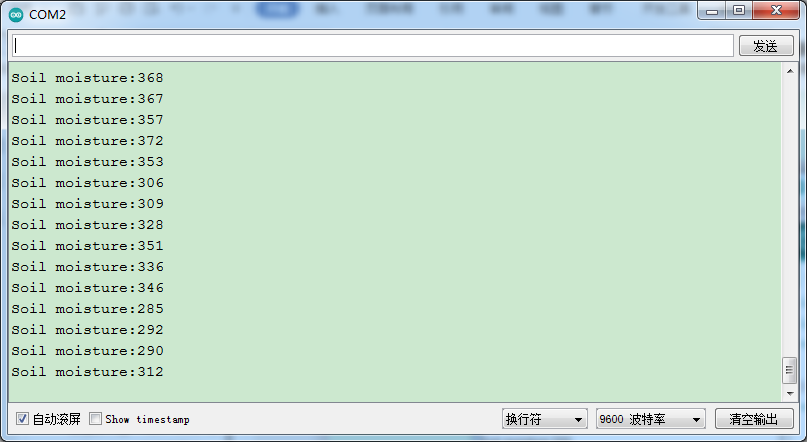

### 项目三十五 土壤传感器

**1.实验说明**

这是一个常用的土壤传感器。它可用于检测土壤中的水分。将它和其他单片机搭配使用，可以制作一款自动浇花装置。长时间不在家或过了浇水的时间，它可以感测到您的植物是否已经渴了。然后我再控制其他设备给您的植物浇水。

实验中，将传感器信号端(S端)输入到arduino系列单片机的模拟口，感知模拟值的变化，并在串口监视器上显示出对应的模拟值。

**2.实验器材**

- keyes brick 土壤传感器*1

- keyes UNO R3开发板*1

- 传感器扩展板*1

- 3P双头XH2.54连接线*1

- USB线*1


**3.接线图**


**4.测试代码**

```
int item = 0;
int Soil = A3; //土壤传感器接A3

void setup() 
{
  Serial.begin(9600);//设置波特率为9600
}

void loop() 
{
  item = analogRead(A3);//读取模拟值
  Serial.print("Soil moisture:");
  Serial.println(item);//打印土壤湿度值
  delay(100);//延时100MS
}
```

**5.测试结果**

烧录好测试代码，按照接线图连接好线，利用USB线上电后，打开软件串口监视器，设置波特率为9600，看到对应土壤湿度的模拟值，土壤湿度越高，模拟值越大，如下图。

