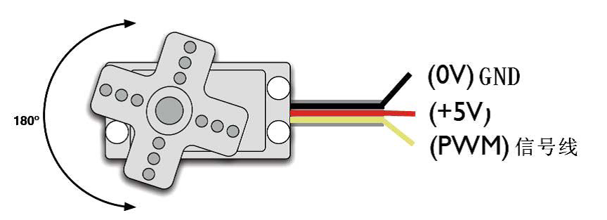
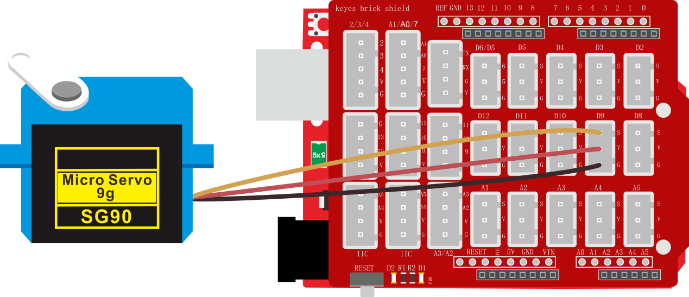

### 项目三十六 舵机控制

**1.实验说明**

舵机是一种位置伺服的驱动器，主要是由外壳、电路板、无核心马达、齿轮与位置检测器所构成。舵机有很多规格，但所有的舵机都有外接三根线，分别用棕、红、橙三种颜色进行区分，由于舵机品牌不同，颜色也会有所差异，棕色为接地线，红色为电源正极线，橙色为信号线。



舵机的转动的角度是通过调节PWM（脉冲宽度调制）信号的占空比来实现的，标准PWM（脉冲宽度调制）信号的周期固定为20ms（50Hz），理论上脉宽分布应在1ms到2ms之间，但是，事实上脉宽可由0.5ms 到2.5ms 之间，脉宽和舵机的转角0°～180°相对应。有一点值得注意的地方，由于舵机牌子不同，对于同一信号，不同牌子的舵机旋转的角度也会有所不同。


**2.实验器材**

- keyes 伺服舵机*1

- keyes UNO R3开发板*1

- 传感器扩展板*1

- USB线*1

**3.接线图**



**4.测试代码**

代码1：

```
int servoPin = 9;//舵机的PIN

void setup() 
{
  pinMode(servoPin, OUTPUT);//舵机引脚设置为输出
}

void loop() 
{
  servopulse(servoPin, 0);//转动到0度
  delay(1000);//延时1秒
  servopulse(servoPin, 90);//转动到90度
  delay(1000);
  servopulse(servoPin, 180);//转动到180度
  delay(1000);
}

void servopulse(int pin, int myangle) //脉冲函数
{ 
  int pulsewidth = map(myangle, 0, 180, 500, 2500); //将角度映射到脉宽
  for (int i = 0; i < 5; i++)  //输出脉冲
  {
    digitalWrite(pin, HIGH);//将舵机接口电平至高
    delayMicroseconds(pulsewidth);//延时脉宽值的微秒数
    digitalWrite(pin, LOW);//将舵机接口电平至低
    delay(20 - pulsewidth / 1000);
  }
}
```

代码2:

```
#include <Servo.h>  //舵机库
Servo myservo;

void setup() 
{
  myservo.attach(9);//舵机连接数字口9
}

void loop() 
{
  for (int pos = 0; pos < 180; pos++) 
  {
    myservo.write(pos); //转动到pos角度
    delay(15);  //加延时转慢一点
  }
  for (int pos = 180; pos > 0; pos--) 
  {
    myservo.write(pos);
    delay(15);
  }
  delay(2000);//等待2秒
}
```

**5.代码1说明**

1. ```   
   map(value, fromLow, fromHigh, toLow, toHigh)；
   ```

   value为要映射的值；fromHigh为当前值的下限和上限；toHigh为我们要映射到的目标范围的下限和上限。比如在实验中map(myangle, 0, 180, 500,  2500)的意思就是传进来一个需要转动的角度值为myangle，然后这个值的范围是0度到180度，要映射的范围为500us到2500us，即把0到180转到了500到2500然后被返回了，返回的数据类型为整型，余数会被截断，不进行四舍五入或平均。

2. 之后定义的的函数servopulse（）就能让舵机转动了，代码中设置了让舵机从0度转动到90度再转动到180度，再转动到0度，中间暂停一秒，反复循环。

**6.代码2说明**

1.  首先先添加舵机库，不然不能编译。

2.  这个库的方法.attach()方法是连接舵机引脚，连到9,10也可以，这里面用到了定时器，使用其他管脚可能会出现冲突。

3.  myservo.write(pos)为转动到pos角度值。myservo.read()是读取舵机当前角度值。

4.  其他设置请参照前面相关的代码说明。

**7.测试结果**

实验1 结果：

上传测试代码成功，利用USB线上电后，舵机由0度，90度，180度三个角度来回转动。

实验2 结果：

上传测试代码成功，利用USB线上电后，舵机由0~180度来回转动，并且每次转动一度。