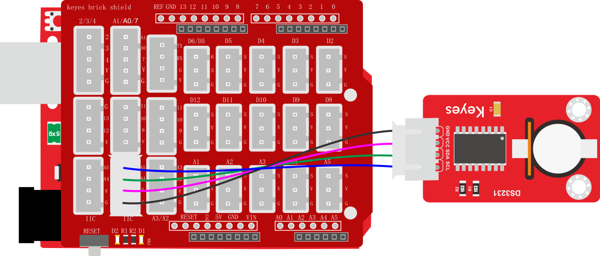
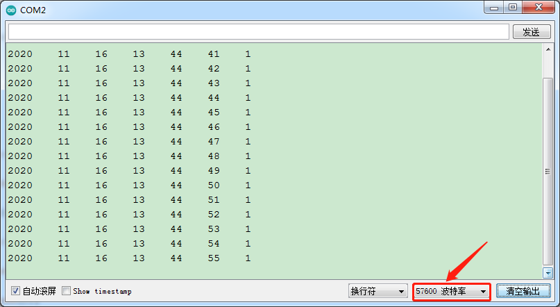

### 项目三十七 3231时钟模块

**1.实验说明**

这个模块主要用到高精度时钟芯片DS3231。它是低成本、高精度I2C实时时钟(RTC)，具有集成的温补晶振(TCXO)和晶体。该器件包含电池输入端，断开主电源时仍可保持精确的计时。集成晶振提高了器件的长期精确度，并减少了生产线的元件数量。DS3231提供商用级和工业级温度范围，采用16引脚300mil的SO封装。

实验中，利用keyes brick时钟模块获取系统时间，将测试结果在串口监视器上显示出来。

**2.实验器材**

- keyes brick 3231时钟模块*1

- keyes UNO R3开发板*1

- 传感器扩展板*1

- 4P双头XH2.54连接线*1

- USB线*1


**3.接线图**



**4.测试代码**

```
//DS3231时钟模块的库
#include <RtcDS3231.h>
#include <SoftwareWire.h>
SoftwareWire myWire(A4, A5); //i2c接口
RtcDS3231<SoftwareWire> Rtc(myWire);

void setup() 
{
  Serial.begin(57600);//设置波特率为57600
  Rtc.Begin();
  Rtc.SetIsRunning(true);
  Rtc.SetDateTime(RtcDateTime(__DATE__, __TIME__));
}

void loop() 
{
  //打印年/月/日/时/分/秒/星期
  Serial.print(Rtc.GetDateTime().Year());
  Serial.print("    ");
  Serial.print(Rtc.GetDateTime().Month());
  Serial.print("    ");
  Serial.print(Rtc.GetDateTime().Day());
  Serial.print("    ");
  Serial.print(Rtc.GetDateTime().Hour());
  Serial.print("    ");
  Serial.print(Rtc.GetDateTime().Minute());
  Serial.print("    ");
  Serial.print(Rtc.GetDateTime().Second());
  Serial.print("    ");
  Serial.println(Rtc.GetDateTime().DayOfWeek());
  delay(1000);//延时1秒
}
```

**5.代码说明**

Rtc.GetDateTime()为获取当前系统的时间和日期。

**6测试结果**

烧录好测试代码，按照接线图连接好线；利用USB接口上电后，进入串口监视器，设置波特率为57600。我们可在软件串口监视器中看到设置时间日期（年、月、日、时、分、秒、周），如下图。

