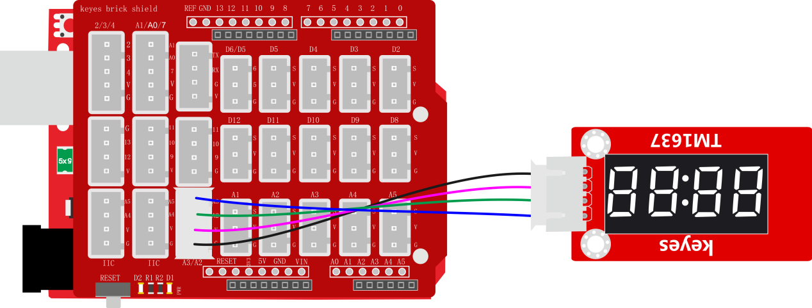

### 项目三十八 TM1637 4位数码管模块

**1.实验说明**

这个模块主要由一个0.36英寸 红色共阳4位数码管组成，它的驱动芯片是TM1637。使用时，只需要2根信号线即可使单片机控制4位8数码管，大大节约了控制板IO口资源。

实验中，利用四位数码管各显示出0~9，并加延迟为1秒。

**2.实验器材**

- keyes brick TM1637 4位数码管模块*1

- keyes UNO R3开发板*1

- 传感器扩展板*1

- 4P双头XH2.54连接线*1

- USB线*1


**3.接线图**



**4.测试代码**

```
#include "SevenSegmentTM1637.h" // 导入SevenSegmentTM1637库

/* 初始化全局TM1637显示对象
  构造函数有两个参数，时钟引脚号和数字输出引脚号：
  SevenSegmentTM1637（pinCLK，pinDIO）;
*/
int PIN_CLK = A3;   //定义CLK引脚为数字口A3
int PIN_DIO = A2;   //定义DIO引脚为数字口A2
SevenSegmentTM1637    display(PIN_CLK, PIN_DIO);

// run setup code
void setup() 
{
  Serial.begin(9600);         // 设置波特率为9600
  display.begin();            // 初始化显示
  display.setBacklight(100);  // 设置亮度为100%
  delay(1000);                // wait 1000 ms
}

void loop() 
{
  display.print("LOOP");                // 显示LOOP
  delay(1000);                          // 等待1秒
  display.clear();                      // 清除显示
  for (uint8_t i = 0; i < 100; i++)    // 循环100次
  {
    display.print(i);                   // 显示计数
    delay(100);                         // 延时100ms
  }
  display.clear();                      // 清除显示
  display.print("SUCC");                // 显示SUCC
  display.blink();                      // 闪烁SUCC
  delay(1000);                          // 等待1秒
}
```

**5.代码说明**

在实验中，先导入TM1637模块的库文件。

**6.测试结果**

烧录好测试代码，按照接线图连接好线,上电后，4位数码管按分刷新时间。