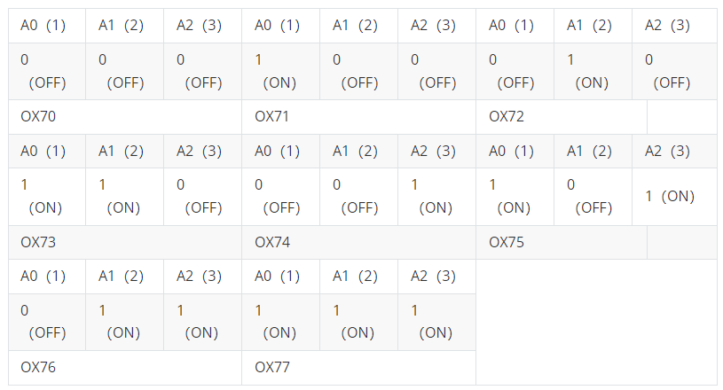
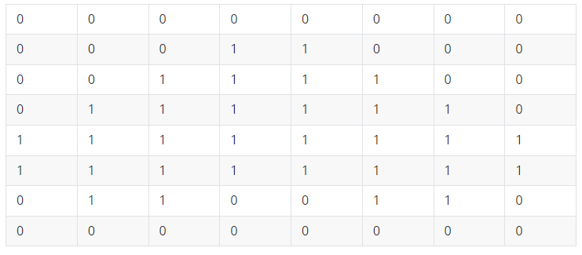

### 项目三十九 8X8点阵模块

**1.实验说明**

利用单片机驱动一个8\*8点阵时，总共需要用到16个数字口，这样就极大的浪费单片机资料。为此，特别设计了这个模块，利用HT16K33芯片驱动1个8\*8点阵，只需要利用单片机的I2C通信端口控制点阵，大大的节约了单片机资源。

模块兼容各种单片机控制板，如arduino系列单片机。使用时，可以在单片机上堆叠一个传感器扩展板。模块和自带导线连接，然后连接在传感器扩展板上，简单方便。模块上自带3个拨码开关，随意拨动开关，这I2C通信地址。设置方法如下表格。



同时，模块自带2个直径为3mm的定位孔，方便将模块固定在其他设备。

实验中让点阵显示出图案。

**2.实验器材**

- keyes brick 8\*8点阵模块*1

- keyes UNO R3开发板*1

- 传感器扩展板*1

- 4P双头XH2.54连接线*1

- USB线*1


**3.接线图**


**4.测试代码**

```
#include <Matrix.h>//点阵的库

Matrix myMatrix(SDA, SCL);
uint8_t  LEDArray[8];

const uint8_t LedArray1[8] PROGMEM = {0x00, 0x18, 0x3c, 0x7e, 0xff, 0xff, 0x66, 0x00};//心形图案

void setup() 
{
  myMatrix.begin(0x70);//iic地址
  myMatrix.clear();//清除显示
  myMatrix.setBrightness(5);//亮度5,范围0~15
}

void loop() 
{
  memcpy_P(&LEDArray, &LedArray1, 8);
  for (int i = 0; i < 8; i++)
  {
    for (int j = 0; j < 8; j++)
    {
      if ((LEDArray[i] & 0x01))
        myMatrix.drawPixel(j, i, 1);
      else
        myMatrix.drawPixel(j, i, 0);
      LEDArray[i] = LEDArray[i] >> 1;
    }
  }
  myMatrix.write();
}
```

**5.代码说明**

1.  先导入库文件

2.  代码中的图案是一个字节数据类型的数组构成，在下面的表格上表示出来。将{0x00, 0x18, 0x3c, 0x7e, 0xff, 0xff, 0x66,     0x00}转化为二进制，填入下面的8\*8表格就清晰了。其中1表示亮，0表示灭，可以看到是一个心形。



**6.测试结果**

烧录好测试代码，按照接线图连接好线；上电后，点阵显示一个心形图案。