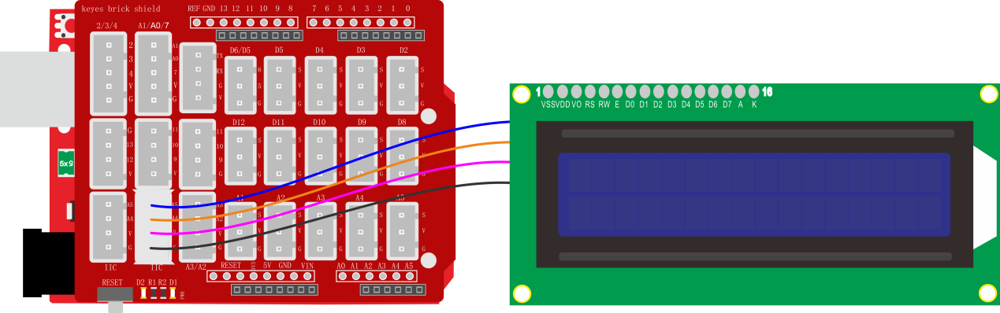

### 项目四十 IIC 1602 液晶屏

**1.实验说明**

这是一个可以显示2行，每行16个字符的液晶屏模块。液晶屏显示蓝底白字，自带I2C通信模块，使用时只需连接单片机I2C通信接口，大大节约了单片机资源。I2C通信模块上带有1个电位器，可用于调节显示屏背光，通信地址默认为0x27。

实验中让IIC 1602显示屏显示出一些字符。

**2.实验器材**

- keyes brick IIC 1602 蓝屏*1

- keyes UNO R3开发板*1

- 传感器扩展板*1

- 4P双头XH2.54连接线*1

- USB线*1


**3.接线图**



**4.测试代码**

```
#include <Wire.h>
#include <LiquidCrystal_I2C.h>//通过i2c驱动lcd显示屏的库函数

LiquidCrystal_I2C mylcd(0x27, 16, 2);//将LCD地址设置为0x27（16个字符和2行）

void setup() 
{
  mylcd.init();//1602初始化
  mylcd.backlight();//设置背光
  mylcd.setCursor(0, 0);//设置光标为第一行第一个字符
  mylcd.print("  Hello World!");//打印
  mylcd.setCursor(0, 1);//设置光标为第二行第一个字符
  mylcd.print("  Hello Keyes!");
}

void loop() 
{

}
```

**5.代码说明**

1.  首先导入库文件

2.  mylcd.init()为初始化1602显示屏；mylcd.backlight()打开背光；mylcd.setCursor()设置光标位置；mylcd.print()显示字符；

**6.测试结果**

烧录好测试代码，按照接线图连接好线；上电后，显示屏两行分别显示" Hello World! "和" Hello Keyes! "字符。