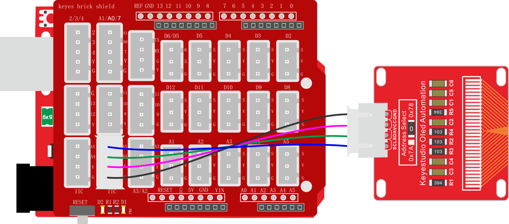
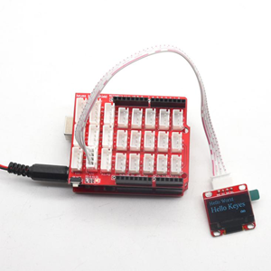

### 项目四十一 IIC OLED模块

**1.实验说明**

oled是有机发光二极管，又称为有机点激光显示。OLED显示技术具有自发光特性，它采用非常薄的有机材料涂层和玻璃基板，当有电流通过时，这些有机材料就会发光。OLED显示屏可视角度大、功耗低。OLED同时具备自发光、不需背光源（只上电是不会亮的，驱动程序和接线正确才会亮）、对比度高、厚度薄、视角广、反应速度快、可用于挠曲面版、使用温度范围广、结构及制程简单等优异特性。

这个模块主要用到一个0.96寸 OLED蓝屏，它是利用SSD1306驱动，利用I2C通信和单片机通信连接。模块自带4个定位孔，方便将模块固定在其他设备。

实验中将让OLED模块显示出一些字符。

**2.实验器材**

- keyes brick IIC OLED模块*1

- keyes UNO R3开发板*1

- 传感器扩展板*1

- 4P双头XH2.54连接线*1

- USB线*1


**3.接线图**



**4.测试代码**

```
#include <U8g2lib.h>
#include <Wire.h>

U8G2_SSD1306_128X64_NONAME_1_HW_I2C u8g2(U8G2_R0, U8X8_PIN_NONE);

void page1() 
{
  u8g2.setFont(u8g2_font_timR12_tf);//12号罗马字体
  u8g2.setFontPosTop();//设置输出位置
  u8g2.setCursor(0, 0);//设置光标为0,0(最大为128,64)
  u8g2.print("Hello World");//显示"Hello World"
  u8g2.setFont(u8g2_font_timR18_tf);////18号罗马字体
  u8g2.setFontPosTop();//设置输出位置
  u8g2.setCursor(0, 20);//设置光标为0,20
  u8g2.print("Hello Keyes");//显示"Hello Keyes"
  u8g2.setFont(u8g2_font_open_iconic_all_2x_t);//设置字体
  u8g2.drawGlyph(100, 30 + 2 * 8, 187);//显示位置和图案
}

void setup() 
{
  u8g2.setI2CAddress(0x3C * 2);
  u8g2.begin();
  u8g2.enableUTF8Print();
}

void loop() 
{
  u8g2.firstPage();   //调用此过程,标志着图像循环的开始
  do
  {
    page1();
  } 
  while (u8g2.nextPage());  //调用此过程,标志着图像循环的结束
}
```

**5.代码说明**

1.  导入OLED的库文件。

2.  可以使用该库函数进行设置想要显示的字符的字体型号、大小、位置、亮度、还可以显示图案，当然也能自己画线、圆、椭圆、矩形、三角形等等，具体查看代码注释。

**6.测试结果**

上传测试代码成功，按照接线图接好线，利用USB上电后，oled显示屏显示“Hello World”“Hello Keyes”和一个自带图像：

