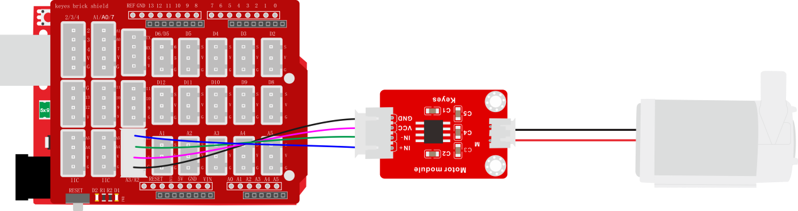

### 项目四十二 电机-水泵驱动模块

**1.实验说明**

在生活中，经常需要驱动一个风扇转动或者或者一个小水泵。为了方便接线，特别设计了130电机-DC3-5V浇花小水泵驱动模块。使用时，只需要将水泵或130电机两端连接在模块的2pin接口上，同时，模块的4pin接口用于连接对应单片机，用于控制电机或水泵状态。

模块兼容各种单片机控制板，如arduino系列单片机。模块上自带的防反插白色端子兼具为2.54mm，使用时，可以利用杜邦线连接到单片机。为方便接线，还特别设计了一款完全兼容这模块和Arduino UNO R3单片机的扩展板，只需要将扩展板堆叠到UNO R3单片机，利用1根3P双头XH2.54插头线（防反）即可连接在扩展板上，简单方便。

实验中，让电机转动起来和小水泵抽水。

**2.实验器材**

- keyes brick电机-水泵驱动模块*1

- keyes UNO R3开发板*1

- 传感器扩展板*1

- 4P双头XH2.54连接线*1

- USB线*1

- DC3-5V浇花小水泵+100MM连接线*1

- 浇花水管 内径6MM 外径8MM 1米*1

- 130电机+100MM连接线*1

- 电机桨*1


**3.接线图**

电机接线图：


水泵接线图：



**4.测试代码**

电机：

```
void setup() 
{
  //设置电机引脚为输出
  pinMode(A2, OUTPUT);
  pinMode(A3, OUTPUT);
}

void loop()
 {
  //逆时针转
  digitalWrite(A2, LOW);
  digitalWrite(A3, HIGH);
  delay(2000);
  //停止
  digitalWrite(A2, LOW);
  digitalWrite(A3, LOW);
  delay(1000);
  //顺时针转
  digitalWrite(A2, HIGH);
  digitalWrite(A3, LOW);
  delay(2000);
  //停止
  digitalWrite(A2, LOW);
  digitalWrite(A3, LOW);
  delay(1000);
}
```

水泵：

```
void setup() 
{
  //设置水泵引脚为输出
  pinMode(A2, OUTPUT);
  pinMode(A3, OUTPUT);
}

void loop() 
{
  //开水泵
  digitalWrite(A2, HIGH);
  digitalWrite(A3, LOW);
  delay(3000);
  //关水泵
  digitalWrite(A2, LOW);
  digitalWrite(A3, LOW);
  delay(1000);
}
```

**5.代码1说明**

将管脚设置为A2、A3，当A2输出为低电平，A3输出为高电平时，电机逆时针旋转；当A2输出为高电平，A3输出为低电平时，电机顺时针旋转；当两个管脚都设置为低电平时，电机停止转动。

**6.代码2说明**

当A2输出为低电平，A3输出为高电平时，水泵工作（两个引脚的电平输出反过来也行，这个水泵没有正负极）；当A2、A3都输出低电平时水泵停止工作。

**7.测试结果**

烧录好测试130电机代码，按照接线图连接好线；上电后，风扇逆时针转动2秒；停止1秒；顺时针转动2秒；停止1秒；循环交替。

烧录好测试小水泵代码，按照接线图连接好线；将小水泵放入水中，上电后，水泵抽水3秒停止1秒，循环交替。