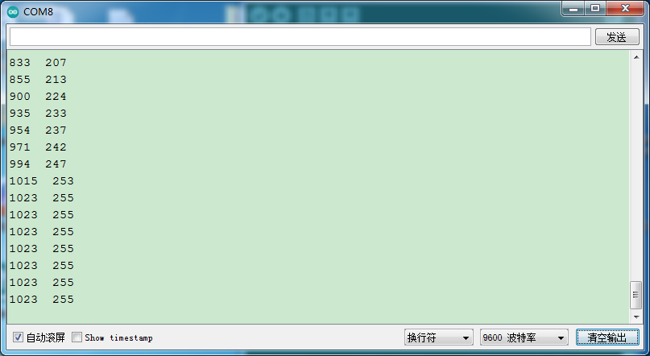

### 项目四十三 电位器调节灯光亮度

**1.实验说明**

在前面课程中，学习了利用代码调节LED模块上LED亮度的方法。学习利用可调电位器读取模拟值的方法。两个组合，利用可调电位器读取到的模拟值控制LED的亮度。设计代码时，模拟值的范围是0-1023；LED的亮度是由PWM值控制，范围为0-255。在这里需要用到映射功能，将0-1023数值映射到0-255。

设置成功后，可以通过旋转电位器，控制模块上LED的亮度。

**2.实验器材**

- keyes brick LED模块*1

- keyes brick 可调电位器模块*1

- keyes UNO R3开发板*1

- 传感器扩展板*1

- 3P 双头XH2.54连接线\*2

- USB线*1


**3.接线图**


**4.测试代码**

```
int val1 = 0;
int val2 = 0;

void setup() 
{
  Serial.begin(9600);
}

void loop() 
{
  val1 = analogRead(A3);
  Serial.print(val1);
  Serial.print("  ");
  val2 = map(val1, 0, 1023, 0, 255);
  Serial.println(val2);
  analogWrite(3, val2);
  delay(100);
}
```

**5.代码说明**

实验中映射功能将val1从范围0-1023映射到0-255，并赋值给val2，这里可参照前面实验二十。

**6.测试结果**

上传测试代码成功，上电后，旋转模块上电位器，就可以调节LED模块上的LED的亮度。

