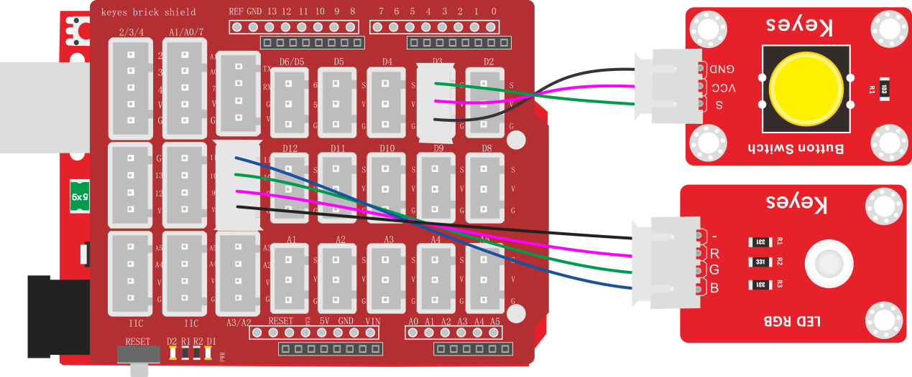
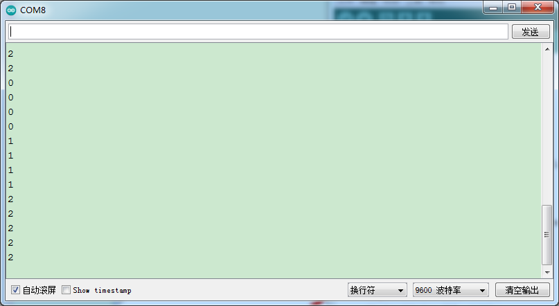

### 项目四十六 按键控制RGB灯

**1.实验说明**

在前面课程中，利用旋转编码器计数然后控制RGB模块。在这一课程中，利用代码，计算出按下模块上按键的次数。设置计数代码时，可以参考第四章实验十七的计数代码。然后将所得数据除以三，所得余数为0 1 2三种。然后通过不同的余数，控制RGB模块上LED显示不同的颜色。

这样，就可以通过不断的按下按键，任意调节RGB模块上LED显示不同颜色了（三种颜色）。

**2.实验器材**

- keyes brick 插件RGB模块*1

- keyes UNO R3开发板*1

- keyes brick 按键传感器*1

- 传感器扩展板*1

- 4P双头XH2.54连接线*1

- 3P 双头XH2.54连接线*1

- USB线*1


**3.接线图**



**4.测试代码**

```
volatile int PushCounter;
volatile int State;
volatile int lastState;
volatile int PushCounter1;

void setup() 
{
  PushCounter = 0;
  State = 1;
  lastState = 1;
  PushCounter1 = 0;
  Serial.begin(9600);
  pinMode(3, INPUT);
  pinMode(9, OUTPUT);
  pinMode(10, OUTPUT);
  pinMode(11, OUTPUT);
}

void loop() 
{
  State = digitalRead(3);
  if (State != lastState) 
  {
    if (State == 0) 
    {
      PushCounter = PushCounter + 1;
    }
  }
  lastState = State;
  PushCounter1 = (long) (PushCounter) % (long) (3);
  Serial.println(PushCounter1);
  delay(200);
  if (PushCounter1 == 0) 
  {
    digitalWrite(9, HIGH);
    digitalWrite(10, LOW);
    digitalWrite(11, LOW);
  } 
  else if (PushCounter1 == 1) 
  {
    digitalWrite(9, LOW);
    digitalWrite(10, HIGH);
    digitalWrite(11, LOW);
  } else if (PushCounter1 == 2) 
  {
    digitalWrite(9, LOW);
    digitalWrite(10, LOW);
    digitalWrite(11, HIGH);
  }
}
```

**5.代码说明**

通过以下表格，了解这个代码的逻辑设置。

| 初始设置           | PushCounter设置为0（累计通过物体数目）<br>PushCounter1设置为0（累计通过物体数目除以3的余数）<br>State设置为1（传感信号端数值）<br>lastState设置为1（传感器信号端上一循环数值） |                                 |                        |
| ------------------ | ------------------------------------------------------------ | ------------------------------- | ---------------------- |
| 按键按下（一瞬间） | State检测到变为0，lastState为1，两个数据不相等。             | PushCounter设置为PushCounter加1 | PushCounter1加1或变为0 |
| 长按按键（循环）   | State检测到变为0，lastState设置为0，两个数据相等。           | PushCounter不变                 | PushCounte1不变        |
| 松开按键（一瞬间） | State检测到变为1，lastState设置为0，两个数据不相等。         | PushCounter不变                 | PushCounte1不变        |
| 按键松开（循环）   | State检测到变为1，lastState设置为1，两个数据相等。           | PushCounter不变                 | PushCounte1不变        |
| PushCounte1为0     | 设置RGB模块上LED显示红色                                     |                                 |                        |
| PushCounte1为1     | 设置RGB模块上LED显示绿色                                     |                                 |                        |
| PushCounte1为2     | 设置RGB模块上LED显示蓝色                                     |                                 |                        |

**6.测试结果**

上传测试代码成功，按照接线图接好线，利用USB上电后，打开串口监视器，设置波特率为9600；串口监视器显示PushCounte1数据，不断按下按键，PushCounte1数据在0 1 2中变化。当PushCounte1为0时，RGB模块上LED显示红色；当PushCounte1为1时，RGB模块上LED显示绿色；当PushCounte1为2时，RGB模块上LED显示蓝色。

