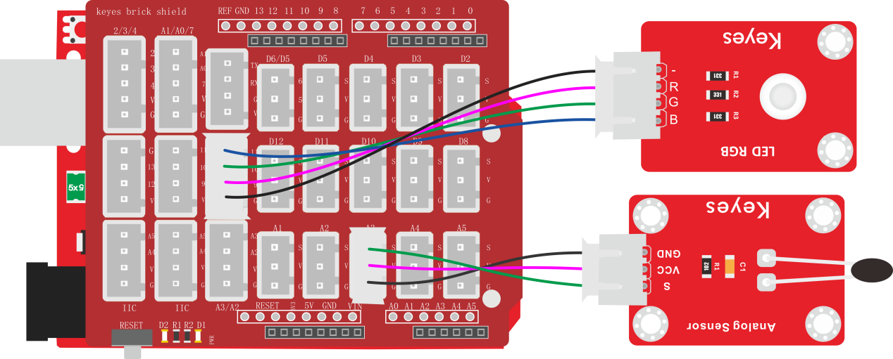
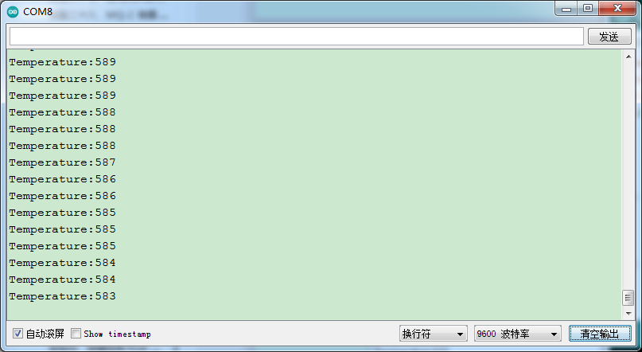

### 项目四十七 温度控制RGB灯

**1.实验说明**

在前面实验中，利用按键手动控制RGB模块上LED灯的颜色。在这一课程中，利用一个热敏电阻传感器检测当前环境的温度。然后利用检测到的温度数据控制RGB模块上LED灯的颜色。

生活中，可以把这个电路设计应用到环境中。利用温度传感器检测到环境温度，控制LED的颜色。这样就可以通过LED颜色，判断周围环境大概温度。

**2.实验器材**

- keyes brick 插件RGB模块*1

- keyes UNO R3开发板*1

- keyes brick 热敏电阻传感器*1

- 传感器扩展板*1

- 4P双头XH2.54连接线*1

- 3P 双头XH2.54连接线*1

- USB线*1


**3.接线图**



**4.测试代码**

```
volatile int val;

void setup() 
{
  val = 0;
  Serial.begin(9600);
  pinMode(9, OUTPUT);
  pinMode(10, OUTPUT);
  pinMode(11, OUTPUT);
}

void loop() 
{
  val = analogRead(A3);
  Serial.print("Temperature:");
  Serial.println(val);
  delay(100);
  if (val <= 400) 
  {
    digitalWrite(9, LOW);
    digitalWrite(10, LOW);
    digitalWrite(11, HIGH);

  } 
  else if (val > 400 && val <= 600) 
  {
    digitalWrite(9, LOW);
    digitalWrite(10, HIGH);
    digitalWrite(11, LOW);
  } 
  else if (val > 600) 
  {
    digitalWrite(9, HIGH);
    digitalWrite(10, LOW);
    digitalWrite(11, LOW);
  }
}
```

**5.代码说明**

1.  实验中，检测并显示温度的方法和上一课中一样。
2.  检测到温度数据后通过设置if判断控制RGB模块上的LED颜色，设置方法参考上一课中知识点。

**6.测试结果**

上传测试代码成功，按照接线图接好线，利用USB上电后，打开串口监视器，设置波特率为9600；串口监视器显示当前环境中温度数值。当模拟值小于400时，RGB模块上的LED显示蓝色；当模拟值大于400且小于等于600时，RGB模块上的LED显示绿色；当模拟值大于600时，RGB模块上的LED显示红色。

