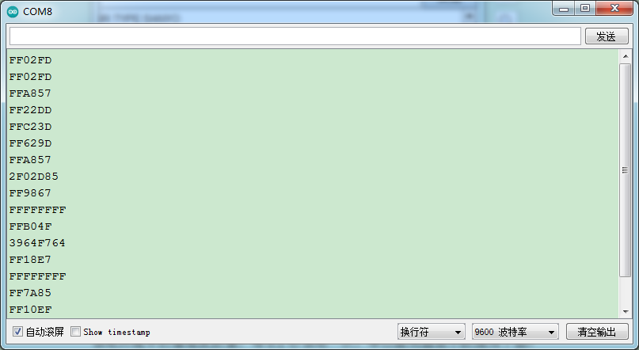
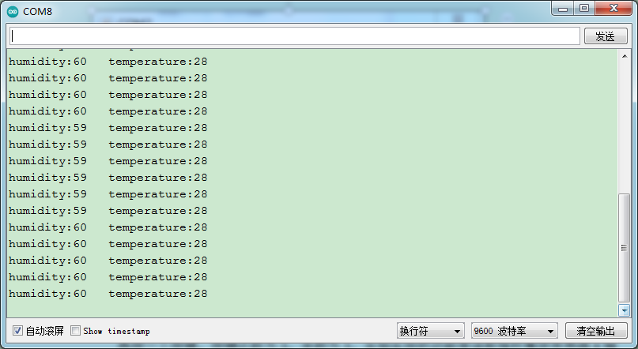
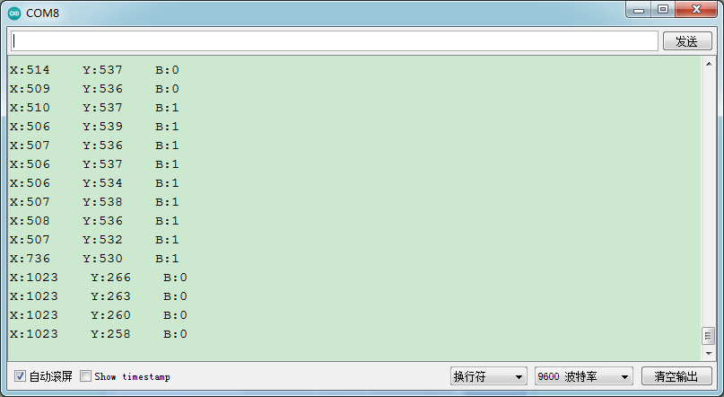
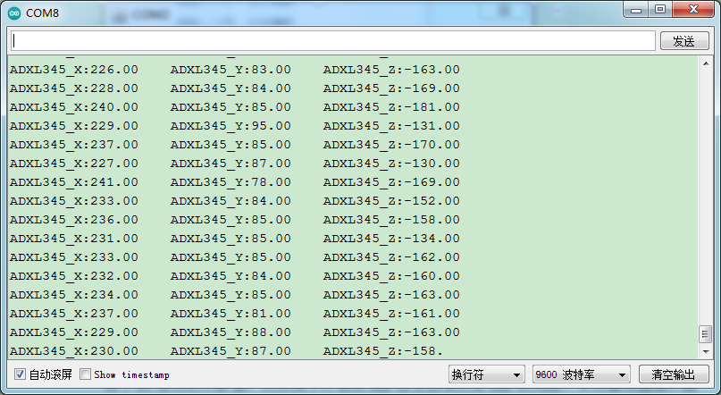
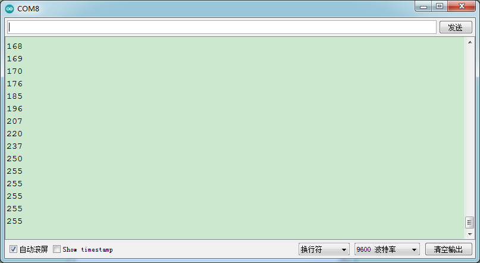
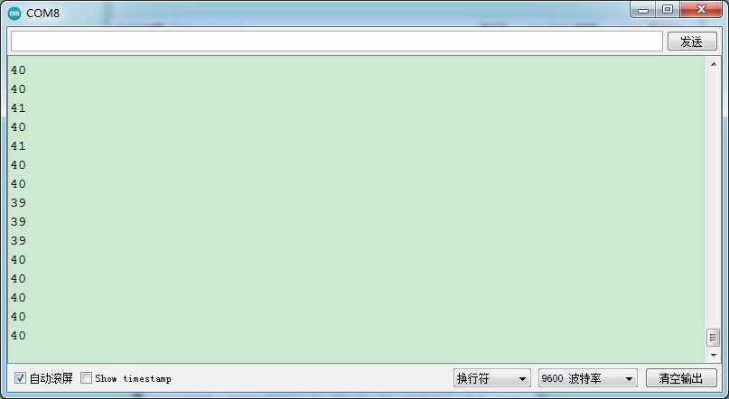
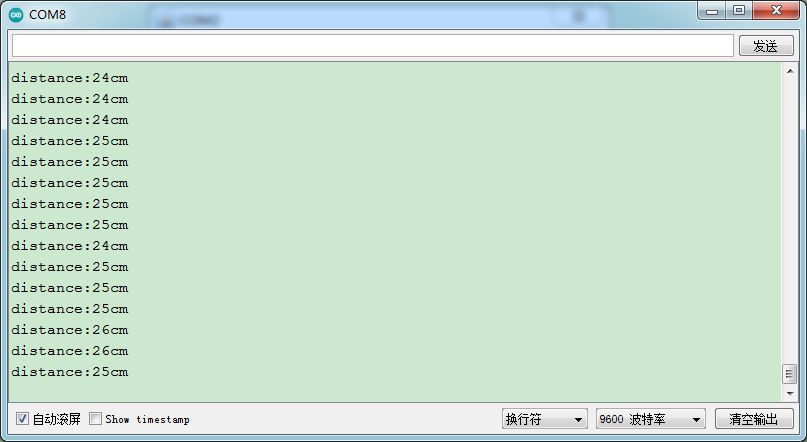

### 项目五十三 综合实验

**1.实验说明**

在前面做了很多实验，每做一个实验，都需要重新上传一次代码。可以把多个实验组合在一起吗？可以的，在这一实验中，将前面的一些实验组合在一起。设置时，利用外接按键模块。每按一次按键，功能变换一次，实验功能循环交替。

**2.实验器材**

- keyes brick LED白发白模块*1

- keyes brick 按键传感器*1

- keyes brick DHT11温湿度传感器*1

- keyes brick ADXL345加速度传感器*1

- keyes brick 红外接收传感器*1

- keyes brick 摇杆模块传感器*1

- keyes brick HC-SR04超声波传感器*1

- keyes brick TEMT6000光线传感器*1

- keyes brick 可调电位器模块*1

- keyes brick 插件RGB模块*1

- keyes UNO R3开发板*1

- 传感器扩展板*1

- 3P 双头XH2.54连接线\*6

- 4P 双头XH2.54连接线\*3

- 5P 双头XH2.54连接线*1

- JMP-1 17键 红外遥控*1

- USB线*1


**3.接线图**


**4.测试代码**

```
#include <Wire.h>
#include <I2Cdev.h>
#include <ADXL345.h>
#include <dht11.h>
#include <IRremote.h>
dht11 DHT;
#define DHT11_PIN 8
int PushCounter = 0;
int State = 1;
int LastState = 1;
int PushCounter1 = 0;
int val1 = 0;
int val2 = 0;
int x = 0;
int y = 0;
int button = 0;
float ADXL345_X = 0;
float ADXL345_Y = 0;
float ADXL345_Z = 0;
int val3 = 0;
int val4 = 0;
int val5 = 0;
int distance = 0;

ADXL345 accel;
IRrecv irrecv(4);
decode_results results;

float checkdistance_12_13() 
{
  digitalWrite(12, LOW);
  delayMicroseconds(2);
  digitalWrite(12, HIGH);
  delayMicroseconds(10);
  digitalWrite(12, LOW);
  float distance = pulseIn(13, HIGH) / 58.00;
  delay(10);
  return distance;
}

void yushu_0() 
{
  digitalWrite(9, HIGH);
  digitalWrite(10, LOW);
  digitalWrite(11, LOW);
  delay(300);
  digitalWrite(9, LOW);
  digitalWrite(10, HIGH);
  digitalWrite(11, LOW);
  delay(300);
  digitalWrite(9, LOW);
  digitalWrite(10, LOW);
  digitalWrite(11, HIGH);
  delay(300);
}

void yushu_1() 
{
  if (irrecv.decode(&results)) 
  {
    Serial.println(results.value, HEX);
    irrecv.resume();
  }
}

void yushu_2() 
{
  int chk;
  chk = DHT.read(DHT11_PIN);    // READ DATA
  switch (chk) 
  {
    case DHTLIB_OK:
      break;
    case DHTLIB_ERROR_CHECKSUM: //校检和错误返回
      break;
    case DHTLIB_ERROR_TIMEOUT: //超时错误返回
      break;
    default:
      break;
  }
  // DISPLAT DATA
  Serial.print("humidity:");
  Serial.print(DHT.humidity);
  Serial.print("   temperature:");
  Serial.println(DHT.temperature);
  delay(200);
}

void yushu_3() 
{
  x = analogRead(A0);
  y = analogRead(A1);
  button = digitalRead(7);
  Serial.print("X:");
  Serial.print(x);
  Serial.print("    Y:");
  Serial.print(y);
  Serial.print("    B:");
  Serial.println(button);
  delay(100);
}

void yushu_4() 
{
  ADXL345_X = accel.getAccelerationX();
  ADXL345_Y = accel.getAccelerationY();
  ADXL345_Z = accel.getAccelerationZ();
  Serial.print("ADXL345_X:");
  Serial.print(ADXL345_X);
  Serial.print("    ADXL345_Y:");
  Serial.print(ADXL345_Y);
  Serial.print("    ADXL345_Z:");
  Serial.println(ADXL345_Z);
  delay(50);
}

void yushu_5() 
{
  val3 = analogRead(A3);
  val4 = map(val3, 0, 1023, 0, 255);
  Serial.println(val4);
  analogWrite(5, val4);
  delay(100);
}

void yushu_6() 
{
  val5 = analogRead(A2);
  Serial.println(val5);
  delay(100);
}

void yushu_7() 
{
  distance = checkdistance_12_13();
  Serial.print("distance:");
  Serial.print(distance);
  Serial.println("cm");
  delay(100);
}

void setup() 
{
  pinMode(2, INPUT);
  pinMode(9, OUTPUT);
  pinMode(10, OUTPUT);
  pinMode(11, OUTPUT);
  Serial.begin(9600);
  Wire.begin();
  accel.initialize();

  pinMode(7, INPUT);
  irrecv.enableIRIn();
  pinMode(12, OUTPUT);
  pinMode(13, INPUT);
}

void loop() 
{
  State = digitalRead(2);
  if (State != LastState) 
  {
    if (State == 0) 
    {
      PushCounter = PushCounter + 1;
    }
  }
  
  LastState = State;
  PushCounter1 = (long) (PushCounter) % (long) (8);
  if (PushCounter1 == 0) 
  {
    yushu_0();
  } 
  else if (PushCounter1 == 1) 
  {
    yushu_1();
  } 
  else if (PushCounter1 == 2) 
  {
    yushu_2();
  } 
  else if (PushCounter1 == 3) 
  {
    yushu_3();
  } 
  else if (PushCounter1 == 4) 
  {
    yushu_4();
  } 
  else if (PushCounter1 == 5) 
  {
    yushu_5();
  } 
  else if (PushCounter1 == 6) 
  {
    yushu_6();
  } 
  else if (PushCounter1 == 7) 
  {
    yushu_7();
  }
}
```

**5.代码说明**

1.  设置时，计算出按下按键的次数，除以8，得到余数，为0 1 2 3 4 5 6 7，根据不同的余数，控制实验实现不同功能。

2.  实验中，对应功能，都利用了子程序设置。子程序设置方法，可以参考前面章节实验。

3.  参照介绍方法，可以在接线中添加或减少传感器/模块，然后在代码中更改实验功能。

**6.测试结果**

上传测试代码成功，按照接线图接好线，利用USB上电。

刚开始时，按键次数为0，余数为0，RGB模块上LED循环闪烁红绿蓝三种颜色。点击打卡串口监视器，设置波特率为9600，按一下按键（时间长些），按键次数为1，余数为1，RGB模块上LED显示蓝色，实验实现的功能是红外接收模块红外发射信息。如果利用红外遥控对准接收模块接收头，按下按键，红外接收头接收到信息，串口监视器显示如下。



特别注意：如果先按下按键，按键次数变为1，再打开串口监视器时，程序会复位，按键成次数会变为0，需要再按下按键重新设置按键次数。

再按一下按键，按键次数为2，余数为2，实验实现的功能是利用DHT11温湿度传感器读取环境中的温湿度数值，每0.1秒读取一次，串口监视器显示数据如下图。



再按一下按键，按键次数为3，余数为3，实验实现的功能是读取摇杆模块传感器X轴和Y轴对应的模拟值，B（Z轴）接口对应的数字值，串口监视器显示如下图。



再按一下按键，按键次数为4，余数为4，实验实现的功能是利用ADXL345加速度传感器测试X Y Z 3轴加速度数值，单位为g，串口监视器显示如下图。



再按一下按键，按键次数为5，余数为5，实验实现的功能是利用外接可调电位器模块调节D5接口的PWM值，从而调节外接的LED白发白模块上LED的亮度。串口监视器显示图下图。



再按一下按键，按键次数为6，余数为6，实验实现的功能是利用外接TEMT6000光线传感器输出模拟值，串口监视器显示图下图。



再按一下按键，按键次数为7，余数为7，实验实现的功能是利用超声波模块检测距离并在串口打印出来，串口监视器显示图下图。



再按一下按键，按键次数为8，余数为0，实现初始时的现象。不断按下按键，余数循环变化，实验功能也循环变化。

