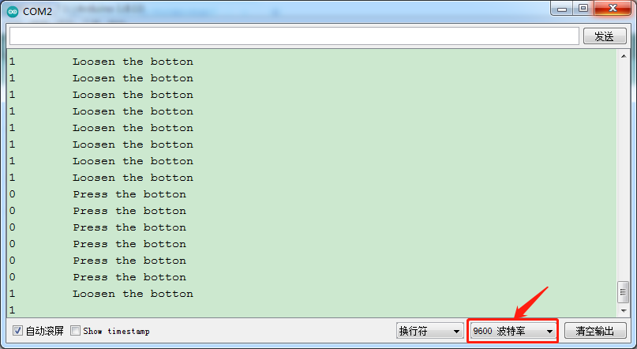

### 项目七 按键传感器检测实验

**1.实验说明**

在这个套件中，有一个keyes brick按键传感器，它主要采用1个轻触开关，自带1个黄色按键帽。按下按键时，传感器信号端为低电平；松开按键时，信号端为高电平。

实验中，通过读取传感器上S端高低电平，判断传感器上按键是否按下；并且在串口监视器上显示测试结果。

**2.实验器材**

- keyes brick按键传感器*1

- keyes UNO R3开发板*1

- 传感器扩展板*1

- 3P双头XH2.54连接线*1

- USB线*1

**3.接线图**


**4.测试代码**

```
int val = 0;
int button = 3; //按键的PIN

void setup() 
{
  Serial.begin(9600); //设置波特率为9600
  pinMode(button, INPUT); //设置为输入模式
}

void loop() 
{
  val = digitalRead(button);  //读取按键的值
  Serial.print(val);  //串口上打印出来
  if (val == 0)  //按下按键则读取到低电平
  {
    Serial.print("        ");
    Serial.println("Press the botton");
    delay(100);
  }
  else 
  {
    Serial.print("        ");
    Serial.println("Loosen the botton");
    delay(100);
  }
}
```

**5.代码说明**

1. inMode(button, INPUT);由前面学过的知识我们知道，在这里我们定义按键管脚3，设置为输入模式。通过pinMode（）配置为INPUT的Arduino（ATmega）引脚处于高阻抗状态。配置为INPUT的引脚对要采样的电路的要求极小，相当于该引脚前面的100MΩ串联电阻。这使它们对于读取传感器很有用。将引脚配置为INPUT，并且正在读取开关，则当开关处于断开状态时，输入引脚将处于“悬空状态”，从而导致不可预测的结果。为了确保开关断开时的读数正确，必须使用上拉或下拉电阻。该电阻的目的是在开关断开时将引脚拉至已知状态。通常选择一个10     K欧姆的电阻，因为它的阻值足够低，可以可靠地防止输入悬空，同时，该阻值也要足够高，以使开关闭合时不会消耗太多电流。如果使用下拉电阻，则当开关断开时，输入引脚将为低电平；当开关闭合时，输入引脚将为高电平。如果使用上拉电阻，则当开关断开时，输入引脚将为高电平；当开关闭合时，输入引脚将为低电平。
2. Serial.begin(9600)；初始化串口通信，并设置波特率为9600.

3. digitalRead(button)；读取按键的数字电平，高HIGH或者低LOW。如果该引脚未连接任何东西，则digitalRead（）可以返回HIGH或LOW（并且可以随机更改）。模拟输入引脚可以用作数字引脚：A0、A1、A2、A3、A4、A5。

4. if..else..语句：当if后面（）的逻辑判断为真时，执行大括号里的代码；否则执行else后面{}里的代码。

5. 代码逻辑是传感器感应到按键按下时，信号端为低电平，D3口为低电平，即val为0。这时我们在串口监视器显示对应的数字值和字符；否则（传感器感应到按键松开时），val为1，窗口监视器显示1和另外的字符。

**6.测试结果**

上传测试代码成功，利用USB线上电后，打开串口监视器，设置波特率为9600。串口监视器显示对应数据和字符。实验中，当传感器按下按键时，val为0，串口监视器显示“Press the button”字符；松开按键时，val为1，串口监视器显示“Loosen the button”字符，如下图。

