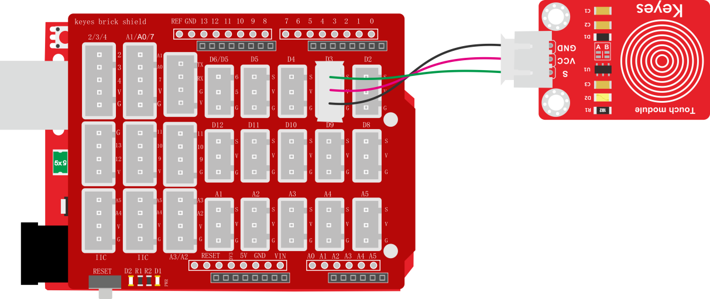
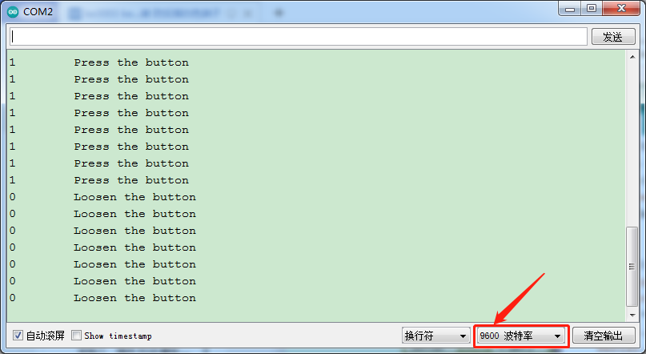

### 项目八 电容触摸传感器检测实验

**1.实验说明**

在这个套件中，有一个keyes brick电容触摸传感器，它主要采用1个TTP223-BA6芯片。它是触摸检测芯片，提供一个触摸按键，功能是用可变面积的按键取代传统按键。上电之后，传感器需要约0.5秒的稳定时间，此时间段内不要对键进行触摸，此时所有功能都被禁止，始终进行自校准，校准周期约为4秒。

实验中，通过读取传感器上S端高低电平，判断传感器上按键是否按下；并且在串口监视器上显示测试结果。

**2.实验器材**

- keyes brick电容触摸传感器*1

- keyes UNO R3开发板*1

- 传感器扩展板*1

- 3P双头XH2.54连接线*1

- USB线*1


**3.接线图**



**4.测试代码**

```
int val = 0;
int button = 3; //按键的PIN

void setup() 
{
  Serial.begin(9600);//波特率为9600
  pinMode(button, INPUT);//设置输入模式
}

void loop() 
{
  val = digitalRead(button);//读取按键的值
  Serial.print(val);//打印出来
  if (val == 1) //按下为高电平
  {
    Serial.print("        ");
    Serial.println("Press the button");
    delay(100);
  }
  else {//松开为低电平
    Serial.print("        ");
    Serial.println("Loosen the button");
    delay(100);
  }
}
```

**5.代码说明**

当我们触摸传感器时，单片机会读取到高电平，即val == 1打印“Press the button”，否则打印“Loosen the button”。细节请参考实验七的代码说明。

**6.测试结果**

上传测试代码成功，利用USB线上电后，打开串口监视器，设置波特率为9600。串口监视器显示对应数据和字符。实验中，当传感器按下按键时，val为1，串口监视器显示“Press the button”字符；松开按键时，val为0，串口监视器显示“Loosen the button”字符，如下图。

