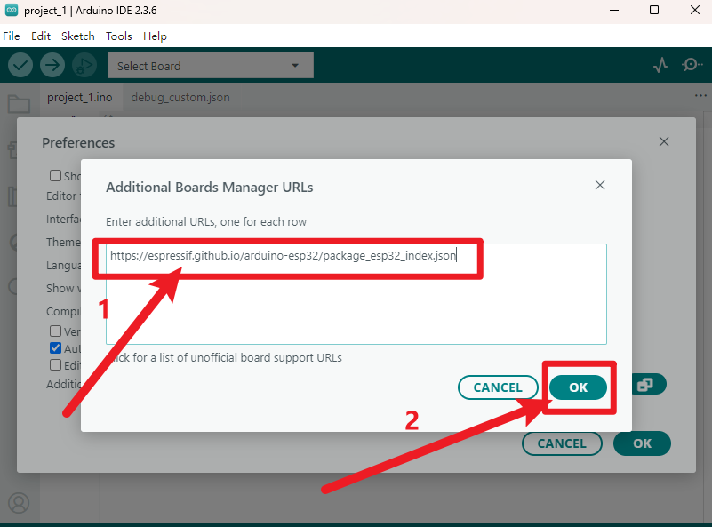
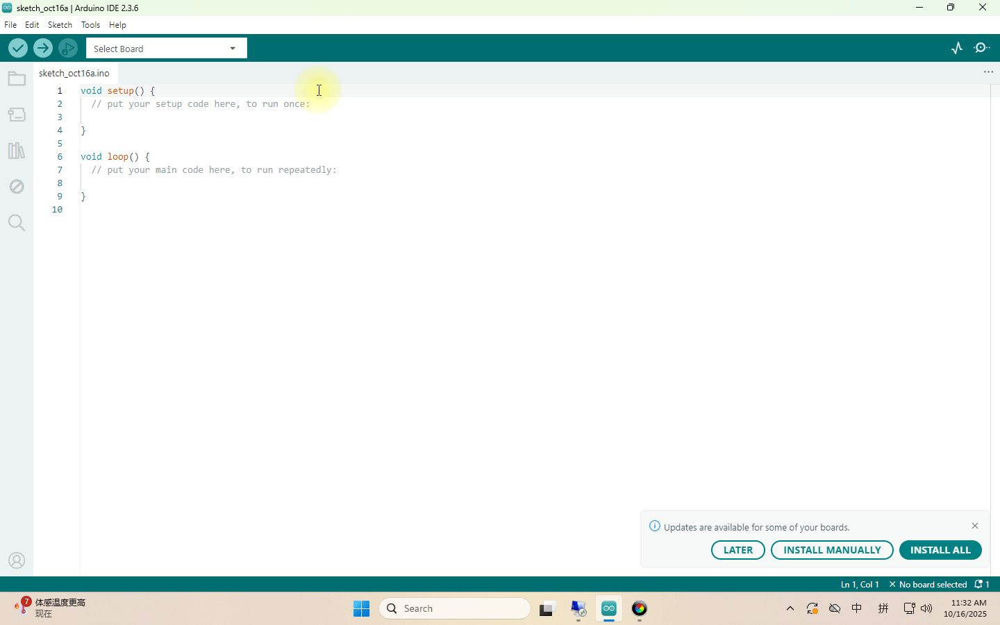
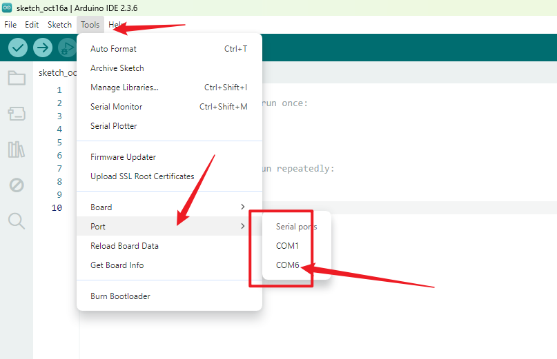

# 3. Arduino Tutorial

## 3.1 Data download

Please note: The library files and code used by Arduino are available for download only at this location. No further download options will be provided thereafter.

Data download:[Arduino Data](./Arduino.7z)

## 3.2 Software Download

When we get control board, we need to download Arduino IDE and driver firstly. 

You could download Arduino IDE from the official website:<https://www.arduino.cc/en/software>.

There are various versions for Arduino,just download a suitable version for your system,we will take WINDOWS system as an example to show you how to download and install.

You just need to click JUSTDOWNLOAD,then click the downloaded file to install it.

And when the ZIP file is downloaded,you can directly unzip and start it.

## 3.3 Installation and configuration of ESP32 environment

1. Click "File" and select "Preferences".

   

2. Click“ ”，Copy and paste the ESP32 development board link: `https://espressif.github.io/arduino-esp32/package_esp32_index.json` into the text box, then click '**OK**'.

   

3. Click 'OK' again.

   

4. Click the small development board icon on the left to open the development board options.

5. In the development board search box, search for "ESP32", select version "2.0.6", and click install.

**Note: You can see the installation progress of the development board in the lower right corner. Please wait a few minutes for the installation to complete. During the installation, keep your network stable. If the installation fails, repeat the above steps and reinstall the development board.**

## 3.4 Add Library

Libraries are a collection of code that makes it easy for you to connect to a sensor,display, module, etc.  

There are hundreds of additional libraries available on the Internet for download. 

 We will introduce the most simple way for you to add libraries . 

Locate the “Libraries” folder within the materials downloaded at the outset, and note its path on your computer; this is of paramount importance.

This method can only import one library file at a time, so we need to repeat the process to import all library files. (Here we demonstrate importing only the AsyncTCP.zip library file; it is advisable to import all libraries at this stage to avoid forgetting in subsequent lessons.)

## 3.5 Driver Check

Here we need to verify whether the drivers are installed on the computer.
1. Without connecting the ESP32 development board to the computer, open the port as shown below. Note the available port options; as illustrated, only COM1 is present.

2. Close the previously opened path and return to the programming interface. Connect the ESP32 development board to the computer, then reopen the port to check for new port options. As shown below, COM6 now appears.

3. At this point, COM6 is the port for the ESP32 development board, confirming that the drivers have been automatically installed.
3. If no new ports appear after connecting to the motherboard, please replace the data cable and try a different USB port on the computer. Should the issue persist, refer to the '**Driver installation**' section to install the driver.

## 3.6 Software Configuration Check

At this point, we have completed all software configurations. Now connect the ESP32 development board to the computer and verify that the environment is functioning correctly.

Note: We can simply upload the default code directly. Successful upload confirms our environment configuration is working correctly, as demonstrated in the animated gif.
