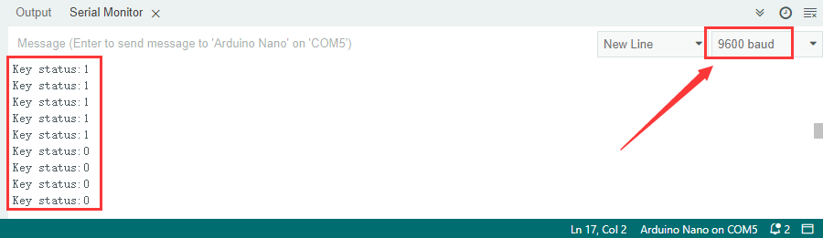

### **Project 13 Mini Lamp**

**1. Description**

In this project, we are going to control a lamp via Arduino UNO and a button. When we press the button, the state of the lamp will shift(ON or OFF).

**2. Working Principle**


When the button is released, a voltage VCC passing through R29 provides a high level for S terminal. When pressed, pin 1 and 3, pin 2 and 4 are connected and voltage on S1 arrives GND as a low level. At this moment, R29 avoids a short circuit between VCC and GND.

**3. Wiring Diagram**


**4.  Test Code**

```
/*
  keyestudio ESP32 Inventor Learning Kit 
  Project 13.1 Mini Lamp
  http://www.keyestudio.com
*/
int button = 15;
int value = 0;

void setup() 
{
  Serial.begin(9600); //Set the serial baud rate to 9600 
  pinMode(button, INPUT);  //Connect the button pin to digital port 8 and set it to input mode.
}

void loop() 
{
  value = digitalRead(button);//Read the button value 
  Serial.print("Key status:"); //Print "Key status:" on serial port 
  Serial.println(value); //Print the button variable on the serial port and wrapping lines
}
```

**5. Test Result**

After connecting the wiring and uploading code, open the serial monitor and set the baud rate to 9600. 
When we press the button, serial port prints "Key status: 0"; When we release it, serial port prints "Key status: 1".



**6. Knowledge Expansion**

Next, we will control the LED through the state of buttons. 

- **Flow Chart：**


- **Wiring Diagram:**


- **Code**

```
/*
  keyestudio ESP32 Inventor Learning Kit 
  Project 13.2 Mini Lamp
  http://www.keyestudio.com
*/
#define led	   4
#define button 15
bool ledState = false;

void setup() 
{
  // initialize digital pin PIN_LED as an output.
  pinMode(led, OUTPUT);
  pinMode(button, INPUT);
}

// the loop function runs over and over again forever
void loop() 
{
  if (digitalRead(button) == LOW) {    //When the button value is 0 for the first time, button jitter is triggered, so 20ms is delayed to judge whether the button is equal to 0. 
    delay(20);                              //Delay 20ms
    if (digitalRead(button) == LOW) {   //judge whether the button value is 0
      ledState = !ledState;                 //ledStart is equal to the inverse of its original value, which can be used to light the LED on and off 
      digitalWrite(led, ledState);
    }
    while (digitalRead(button) == LOW);     //hold the button for the while loop, exit it when release it
  }
}
```

- **Test Result**

You can control the red LED light on and off by the red button.

