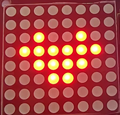

### Project 18 Beating Heart

#### **1. Description**

In this project, a beating heart will be presented via an Arduino board, a 8X8 dot matrix display, a circuit board and some electronic components. By programming, you can control the beating frequency, heart dimension and its brightness. 

**2. Wiring Diagram**


**3. Test Code**

```
/*
  keyestudio ESP32 Inventor Learning Kit  
  Project 18 Beating Heart
  http://www.keyestudio.com
*/

#include "LedControl.h"
int DIN = 23;
int CLK = 18;
int CS = 15;
LedControl lc=LedControl(DIN,CLK,CS,1);
const byte IMAGES1[] = {0x30, 0x78, 0x7c, 0x3e, 0x3e, 0x7c, 0x78, 0x30};  // a big heart
const byte IMAGES2[] = {0x00, 0x10, 0x38, 0x1c, 0x1c, 0x38, 0x10, 0x00};  //a small heart

void setup() 
{
  lc.shutdown(0,false);
  // Set brightness to a medium value
  lc.setIntensity(0,8);
  // Clear the display
  lc.clearDisplay(0);  
}

void loop()
{
  for(int i=0; i < 8; i++)
  {
      lc.setRow(0,i,IMAGES1[i]);
  }
  delay(1000);
  for(int i=0; i < 8; i++)
  {
    lc.setRow(0,i,IMAGES2[i]);
  }
  delay(1000);
}
```

**4.  Test Result**

After connecting the wiring and uploading code, the two sizes of hearts are displayed alternately. 

