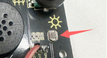
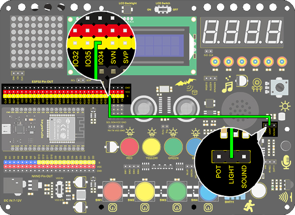

### Project 20 Light Pillar

**1. Description**

The resistance(less than 1KΩ) of the photoresistor varies from the light, thus it can control the brightness of the dot matrix. When controlling, we connect this resistor to an analog pin on the board to monitor the change of resistance. In this way, the light automatically controls the brightness of the display. 

Besides,  the photoresistor is widely applied to our daily life. For instance, a curtain automatically opens or closes according to the outer light intensity. 

**2. Working Principle**




When it is totally in dark, the resistance equals 0.2MΩ, and the voltage at signal terminal (point 2) approaches to 0V. The stronger the light is , the smaller the resistance and voltage will be.

**3. Wiring Diagram**



**4. Test Code**

```
/*
  keyestudio ESP32 Inventor Learning Kit 
  Project 20.1 Light Pillar
  http://www.keyestudio.com
*/
int light = 34;      //Define light to IO34

void setup() 
{
  // put your setup code here, to run once:
  Serial.begin(9600);		//Set baud rate to 9600
}

void loop() 
{
  // put your main code here, to run repeatedly:
  int value = analogRead(light);	//Read IO34 and assign it to the variable value
  Serial.println(value);		//Print the variable value and wrap it around 
  delay(200);
}
```

**5. Test Result**

After connecting the wiring and uploading code, open serial monitor to set baud rate to 9600, the analog value will be displayed, withing the range of 0-4095. Changing the light intensity around it can change its value.


**6. Knowledge Expansion**

We will use this photoresistor to sense the ambient light intensity. The two columns of middle are included in this experiment to represent light intensity. The stronger it is, the more lighted LEDs will be. This forms a "light pillar".

- **Wiring Diagram：**


- **Code：**

```
/*
  keyestudio ESP32 Inventor Learning Kit 
  Project 20.2 Light Pillar
  http://www.keyestudio.com
*/

#include "LedControl.h"
int DIN = 23;
int CLK = 18;
int CS = 15;
LedControl lc=LedControl(DIN,CLK,CS,1);
const byte IMAGES[8] = {0x01,0x03,0x07,0x0F,0x1F,0x3F,0x7F,0xFF}; //Data of light pillar

int light = 34;

void setup() 
{
  lc.shutdown(0,false);
  // Set brightness to a medium value
  lc.setIntensity(0,8);
  // Clear the display
  lc.clearDisplay(0);
  pinMode(light,INPUT);  
}

void loop()
{
  int value = analogRead(light);
  int temp = map(value,0,4095,0,7);  //Convert the range of analog values to 0-7
  lc.setRow(0,3,IMAGES[temp]);      //Display the value of the array IMAGES[temp] in column 3
  lc.setRow(0,4,IMAGES[temp]);      //Display the value of the array IMAGES[temp] in column 4
}
```

- **Test Result**

The stronger the light near the photoresistor, the higher the light column of the LED matrix.


