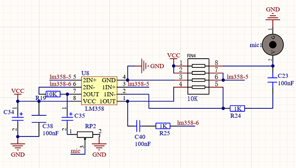
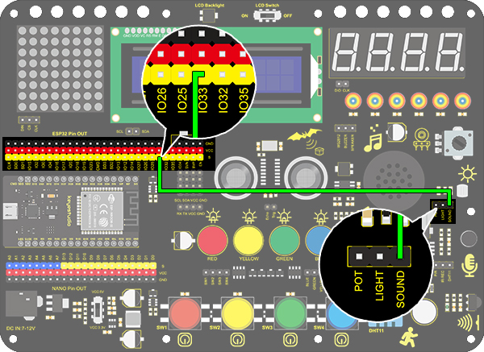
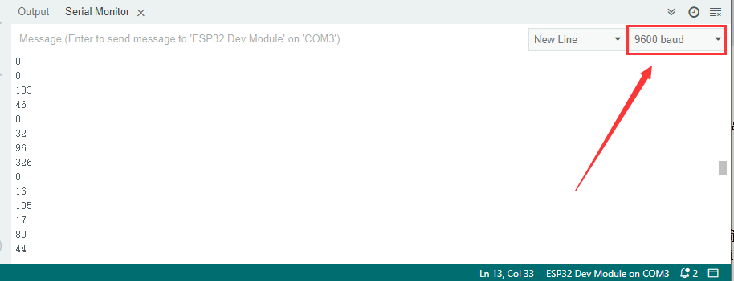

### Project 21 Sound Controlled LED

**1. Description**

Sound controlled LED is a device used to detect sound in a way that controls the brightness of LED, which is composed of a Arduino board and some components. It can connect to multiple sensors such as microphones. It converts sound to changing voltage signal to be received by Arduino to control the LED on and off.

**2. Working Principle**



When detecting a sound, the electret film in microphone vibrates, which changes the capacitance and generates a subtle change of voltage. 

Next, we make use of LM3 chip to build a proper circuit to amplify the detected sound up, which can be adjusted by a potentiometer. Rotate it clockwise to enlarge the times.

**3. Wiring Diagram**



**4. Test Code**

```
/*
  keyestudio ESP32 Inventor Learning Kit 
  Project 21.1：Sound Controlled LED
  http://www.keyestudio.com
*/
int sound = 33; //Define sound as IO33

void setup()
{
  Serial.begin(9600);
  pinMode(sound,INPUT);
}

void loop()
{
  int value = analogRead(sound);
  Serial.println(value);
}
```

**5.  Test Result**

After connecting the wiring and uploading code, open serial monitor to set baud rate to 9600, the analog value will be displayed.



**Sensitivity adjustment：**

If you feel that the sensitivity of the sound sensor is suitable, we can adjust the potentiometer of the sound sensor(right for the highest sensitivity, left for the lowest sensitivity).


**6. Knowledge Expansion**

The commonly seen corridor light is a kind of sound controlled light. Meanwhile, it also includes a photoresistor. Differed from that, here we establish a model that an LED only is affected by sound. When the analog volume exceeds 100, LED lights up for 2S and then goes off. 

- **Flow Chart：**


- **Wiring Diagram：**


- **Code：**

```
/*
  keyestudio ESP32 Inventor Learning Kit 
  Project 21.2：Sound Controlled LED
  http://www.keyestudio.com
*/
int sound = 33;   //Define sound to IO33
int led = 25;      //Define led to IO25

void setup()
{
  pinMode(led,OUTPUT);   //Set IO25 to output 
}

void loop()
{
  int value = analogRead(sound);    //Read analog value of IO33 and assign it to value
  if(value > 100)
  {                  //Judge whether value is greater than 100
    digitalWrite(led,HIGH);         //If IO25 pin outputs high level, LED lights up
    delay(2000);
  }
  else
  {
    digitalWrite(led,LOW);          //If IO25 pin outputs low level, LED lights off
  }
}
```

- **Test Result**

When the value detected by the sound sensor is greater than 100, the red LED will light up.
