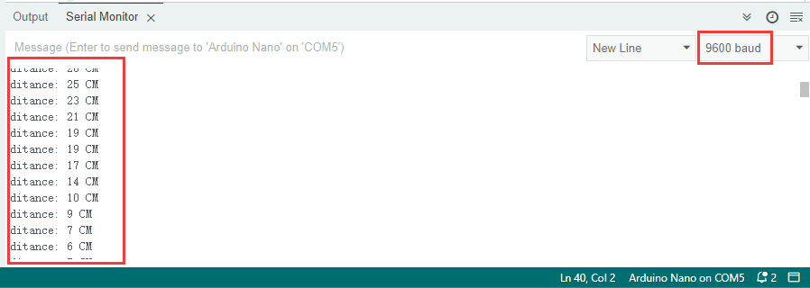

### Project 25 Ultrasonic Rangefinder

**1. Description**

This ultrasonic rangefinder measures distance of obstacles by emitting sound waves and then receiving the echo. That is to say, the distance is not an immediate value, but an observed one by a theoretical calculation of time difference between emitter and receiver. 

Ultrasonic is able to detect the shape of objects, set up automatic doors and estimate flow velocity and pressure. 

What's more, it supports cooperative works with computers. As a result, the measured value can be transmitted to computers via Arduino board. 

In daily life, it is widely used for motors, servos and LEDs as well as systems(automatic navigation, control and security monitoring systems).

**2. Working Principle**


As we all know, ultrasonic is a kind of inaudible sound wave signal with high frequency. Similar to a bat, this module measures distance of obstacles by calculating the time difference between wave-emitting and echo-receiving.

**Maximum distance:** 3M

**Minimum distance:** 5cm

**Detection angle:** ≤15°

**3. Wiring Diagram**


**4. Test Code**

```
/*
  keyestudio ESP32 Inventor Learning Kit  
  Project 25.1：Ultrasonic Rangefinder
  http://www.keyestudio.com
*/
int distance = 0; //Define a variable to receive the diatance value 
int EchoPin = 14; //Connect Echo pin to io14
int TrigPin = 13; //Connect Trig pin to io13

float checkdistance() { //Acquire the distance 
  // preserve a short low level to ensure a clear high pulse:
  digitalWrite(TrigPin, LOW);
  delayMicroseconds(2);    //Delay 2um
  //Trigger the sensor by a high pulse of 10um or longer 
  digitalWrite(TrigPin, HIGH);
  delayMicroseconds(10);		//Delay 10um
  digitalWrite(TrigPin, LOW);
  //Read the signal from the sensor: a high level pulse
  //Duration is detected from the point sending "ping" command to the time receiving echo signal (unit: um).
  float distance = pulseIn(EchoPin, HIGH) / 58.00;  //Convert into distance
  delay(10);
  return distance; //Return the diatance value
}

void setup() 
{
  Serial.begin(9600);//Set the baud rate to 9600
  pinMode(TrigPin, OUTPUT);//Set Trig pin to output
  pinMode(EchoPin, INPUT);  //Set Echo pin to input 
}

void loop() 
{
  distance = checkdistance();   //Assign the read value to "distance" 
  if (distance < 4 || distance >= 400) //Display "-1" if exceeding the detection range 
  {  
    distance = -1;
  }
  Serial.print("ditance: ");
  Serial.print(distance);
  Serial.println(" CM");
  delay(200);
}
```

**5. Test Result**

After connecting the wiring and uploading code, open serial monitor to set baud rate to 9600, the serial port prints the distance value. 



**6. Knowledge Expansion**

Let's make a rangefinder. 

We display characters on LCD 1602. Program to show "Keyestudio" at (3,0) and “distance:” at (0,1) followed by the distance value at (9,1). 

When the value is smaller than 100(or 10), a residue of the third(or the second) bit still exists. Therefore, an "if" judgement is necessary to determine a certain condition.

**Wiring Diagram：**


**Code：**

```
/*
  keyestudio ESP32 Inventor Learning Kit  
  Project 25.2：Ultrasonic Rangefinder
  http://www.keyestudio.com
*/
#include <Wire.h>
#include <LiquidCrystal_I2C.h>
LiquidCrystal_I2C lcd(0x27,16,2); //set the LCD address to 0x27 for a 16 chars and 2 line display

int distance = 0; //Define a variable to receive the diatance value 
int EchoPin = 14; //Connect Echo pin to io14
int TrigPin = 13; //Connect Trig pin to io13
float checkdistance() { //Acquire the distance 
  // preserve a short low level to ensure a clear high pulse:
  digitalWrite(TrigPin, LOW);
  delayMicroseconds(2);
  //Trigger the sensor by a high pulse of 10um or longer 
  digitalWrite(TrigPin, HIGH);
  delayMicroseconds(10);
  digitalWrite(TrigPin, LOW);
  // Read the signal from the sensor: a high level pulse
  //Duration is detected from the point sending "ping" command to the time receiving echo signal (unit: um).
  float distance = pulseIn(EchoPin, HIGH) / 58.00;  //Convert into distance
  delay(10);
  return distance;
}

void setup() 
{
  	Serial.begin(9600);//Set the baud rate to 9600
  	pinMode(TrigPin, OUTPUT);//Set Trig pin to output
  	pinMode(EchoPin, INPUT);  //Set Echo pin to input 
    lcd.init(); // initialize the lcd
    // Print a message to the LCD.
    lcd.backlight();
    lcd.setCursor(3,0);
    lcd.print("Keyestudio");
}

void loop() 
{
  distance = checkdistance();
 
  if (distance < 2 || distance >= 400) //Display "-1" if exceeding the detection range 
  {  
    distance = -1;
  }
  if(distance < 100 && distance > 10){             //Eliminate the shadow of the third digit when the value drops to two digits
    lcd.setCursor(11,1);
    lcd.print(" ");
  }
  if(distance < 10)//Eliminate two-digit shadows when the value drops to one digit
  {              
    lcd.setCursor(10,1);
    lcd.print(" ");
  }
  lcd.setCursor(0,1);
  lcd.print("distance:");
  lcd.setCursor(9,1);
  lcd.print(distance);
  delay(200);
}
```

