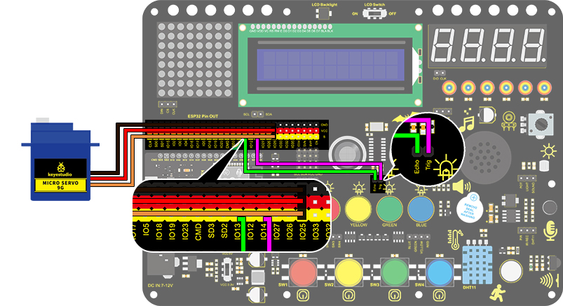

### Project 28 Intelligent Gate

**1. Description**

The intelligent gate is an intelligent parking lot system that  integrates MCU and ultrasonic sensor, which automatically controls the gate according to the distance of cars, so as to better control the car access. 

When a certain distance is reached, MCU receives the signal from the sensor and estimates the distance via the signal intensity. If the car is approaching or leaving, MCU will open or close the gate via a servo. 

**2. Flow Chart**


**3. Wiring Diagram**



**4. Test Code**

```
/*
  keyestudio ESP32 Inventor Learning Kit  
  Project 28 Intelligent Gate
  http://www.keyestudio.com
*/
#define servo_pin  25
int distance = 0; //Define a variable to receive the distance
int EchoPin = 14; //Connect Echo pin to IO14
int TrigPin = 13; //Connect Trig pin to IO13

//Ultrasonic ranging program
float checkdistance() { //Acquire distance
  //preserve a short low level to ensure a clear high pulse:
  digitalWrite(TrigPin, LOW);
  delayMicroseconds(2);
  //Trigger the sensor by a high pulse of 10um or longer
  digitalWrite(TrigPin, HIGH);
  delayMicroseconds(10);
  digitalWrite(TrigPin, LOW);
  //Read the signal from the sensor: a high level pulse
  //Duration is detected from the point sending "ping" command to the time receiving echo signal (unit: um).
  float distance = pulseIn(EchoPin, HIGH) / 58.00;  //Convert into distance
  delay(10);
  return distance;
}

//Servo rotation program
void Set_Angle(int angle_val) //Impulse function
{ 
  int pulsewidth = map(angle_val, 0, 180, 500, 2500); //Map Angle to pulse width
  for (int i = 0; i < 10; i++) { //Output a few more pulses
    digitalWrite(servo_pin, HIGH);//Set the servo interface level to high
    delayMicroseconds(pulsewidth);//The number of microseconds of delayed pulse width value
    digitalWrite(servo_pin, LOW);//Lower the level of servo interface
    delay(20 - pulsewidth / 1000);  //Add the bracket
  }
} 

void setup() 
{
  // put your setup code here, to run once:
  pinMode(servo_pin,OUTPUT);
  pinMode(TrigPin, OUTPUT);//Set Trig pin to output 
  pinMode(EchoPin, INPUT);  //Set Echo pin to input 
}

void loop() 
{
  // put your main code here, to run repeatedly:
 distance = checkdistance();
 Serial.println();
  if(distance < 30)
  {
    Set_Angle(180);
    delay(5000);//Wait for 5s   
  }
  if(distance > 30)
  {
    Set_Angle(0);
  }
}
```

**5. Test Result**

After connecting the wiring and uploading code, the servo will rotate to 180° for 5s if the detected distance is less than 30cm. On the contrary, the servo will rotate to 0°.

