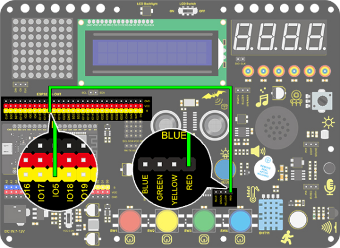

### Project 3 SOS Distress Device

**1. Description**

Arduino SOS device is able to emit distress signals, which coincides with the principle of Morse code. It is convenient for emergencies.

**2. Wiring Diagram**



**3. Test Code**

```
/*
  keyestudio ESP32 Inventor Learning Kit 
  Project 3：SOS Distress Device
  http://www.keyestudio.com
*/
int ledPin = 5;  //Define pin as IO5
 
void setup() 
{
	pinMode(ledPin, OUTPUT);
}
 
void loop() 
{
    //Three quickly blinks mean “S”
    for(int x=0;x<3;x++)
    {
        digitalWrite(ledPin,HIGH);            //Set LED to light up 
        delay(150);                           //Delay 150ms 
        digitalWrite(ledPin,LOW);             //Set LED to turn off 
        delay(100);                           //Delay 100ms 
	}
    delay(200);//delay 200ms to generate the space between letters
 
    //Three slowly blinks mean “O”
    for(int x=0;x<3;x++)
    {
        digitalWrite(ledPin,HIGH);            //Set LED to light up
        delay(400);                           //Delay 400ms
        digitalWrite(ledPin,LOW);             //Set LED to turn off
        delay(200);                           //Delay 200ms
    }
	delay(100);//Delay 100ms to generate the space between letters
 
    // Three quickly blinks mean “S”
    for(int x=0;x<3;x++)
    {
        digitalWrite(ledPin,HIGH);            //Set LED to light up
        delay(150);                           //Delay 150ms
        digitalWrite(ledPin,LOW);             //Set LED to turn off 
        delay(100);                           //Delay 100ms
    } 
	delay(5000);// Wait 5s before repeating S.0.S
}
```

**4. Test Result**

After the code is successfully uploaded, we can see that the LED flashes 3 times quickly, then flashes 3 times slowly and then flashes 3 times quickly, alternating between fast and slow.