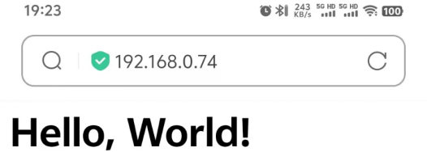

### Project 31 Connect the ESP32 board to WiFi

**1. Description**

ESP32 boasts a built-in Wi-Fi and Bluetooth nodule that is widely used in Internet of Things (IoT). With this function, it can remotely control the data transmission through the wireless network. 

In applications, ESP32 can be used as a client to connect to a Wi-Fi network, or as a hotspot to create its own network. Through these connections, ESP32 receives commands to control external devices, such as turning on/off lights and adjusting temperature. In the code, protocols like HTTP and MQTT are used to communicate with the server to achieve data sending and receiving, so as to remotely control and monitoring.

**2. ESP32 wifi**

ESP32 development board comes with built-in Wi-Fi (2.4G) and Bluetooth (4.2), which enable it to easily connect to Wi-Fi network and communicate with other devices in the network. You can display web pages in your browser via ESP32.

· Base station mode (STA / Wi-Fi Client mode): ESP32 is connected to Wi-Fi hotspot (AP).

· AP mode (Soft-AP / Wi-Fi hotspot mode): Wi-Fi device(s) is(are) connected to ESP32.

· AP-STA mode: ESP32 is both Wi-Fi hotspot and a Wi-Fi device connected to another Wi-Fi.

· These modes supports multiple security modes, including WPA, WPA2 and WEP.

· It is able to scan Wi-Fi hotspot (active or passive)

· It support promiscuous mode monitoring IEEE802.11 Wi-Fi packets.

**3. Wiring Diagram**


**Notes:**

1. You need to prepare a 2.4GHz frequency WIFI(not 5GHz). It can be a mobile hotspot or a router.

2. The ESP32 board consumes more power when connected to the network, so you need to connect an external power supply to this kit. We provide you with a 6XAA Battery Holder (battery not included), which you can connect to the DC port of the ESP32 integrated board.

   

3. Remember your wifi network name and password and fill it into the code before uploading it.

```
const char* ssid = "your_SSID"; // Fill in WiFi name, for example,= "KEYES"
const char* password = "your_password"; // Fill in WiFi password, for example,= "123456"
```

**4. Upload Code**

```
/*
  keyestudio ESP32 Inventor Learning Kit
  Project 31 ESP32 WiFi
  http://www.keyestudio.com
*/
#include <WiFi.h>
#include <LiquidCrystal_I2C.h>

LiquidCrystal_I2C lcd(0x27, 16, 2);
const char* ssid = "your_SSID"; // set to your WiFi name
const char* password = "your_password"; // set your WiFi password
WiFiServer server(80);
int i = 0;

void setup() 
{
  lcd.init();  // initialize the lcd
  // We start by connecting to a WiFi network
  lcd.backlight();

  lcd.setCursor(0, 0);
  lcd.print("IP:");

  WiFi.begin(ssid, password);

  while (WiFi.status() != WL_CONNECTED) 
  {
    lcd.setCursor(i, 1);
    lcd.print(".");
    delay(500);
    i++;
    if (i > 15) 
    {
      i = 0;
      lcd.setCursor(0, 1);
      lcd.print("                ");
    }
  }
  lcd.setCursor(0, 1);
  lcd.print("                ");
  lcd.setCursor(0, 1);
  lcd.print(WiFi.localIP());
}

void loop() 
{
}
```

**5. Test Result**

After uploading the code, LCD1602 shows the IP address of the wifi that you connected to ESP32.


**6. Knowledge Expansion**

IP address displays “Holly World!”.

```
#include <WiFi.h>
#include <ESPAsyncWebServer.h>
#include <LiquidCrystal_I2C.h>
LiquidCrystal_I2C lcd(0x27, 16, 2);

// WiFi configuration

const char* ssid = "your-SSID";     // your WiFi name
const char* password = "your-PASSWORD";  // your WiFi password
int i = 0;
// Create a Web Server
AsyncWebServer server(80);

void setup() 
{
  lcd.init();  // initialize the lcd
  lcd.backlight();
  lcd.setCursor(0, 0);
  lcd.print("IP:");

  // WiFi connection
  WiFi.begin(ssid, password);
  while (WiFi.status() != WL_CONNECTED) 
  {
    lcd.setCursor(i, 1);
    lcd.print(".");
    delay(500);
    i++;
    if (i > 15) 
    {
      i = 0;
      lcd.setCursor(0, 1);
      lcd.print("                ");
    }
  }
  lcd.setCursor(0, 1);
  lcd.print("                ");
  lcd.setCursor(0, 1);
  lcd.print(WiFi.localIP());

  // Process the client request and return to the page
  server.on("/", HTTP_GET, [](AsyncWebServerRequest* request) {
    String html = generateHTML();
    request->send(200, "text/html", html);
  });
  // Start the Web server
  server.begin();
}

String generateHTML()
{
  // Generate HTML page
  String html = "<html><head>";
  html += "<h1>Hello, World!</h1>";
  html += "</head></html>";
  return html;
}

void loop() 
{
}
```

**7. Test result**

Use a computer or mobile phone that is connected to the same network as the ESP32 board, and access the IP address shown on the LCD1602 and you will see “Hello world”.



