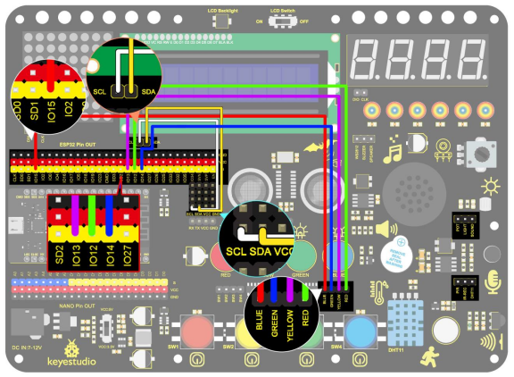

### Project 32 ESP32 WiFi Control LED

**1. Description**

Next we will learn to control the LED through wifi on a mobile phone or a computer.

**Notes:**

1. You need to prepare your a 2.4GHz frequency WIFI, not 5GHz frequency. It can be a mobile hotspot or a router.

2. The ESP32 board consumes more power when connected to the network, so you need to connect an external power supply to this kit. We provide you with a 6XAA Battery Holder (battery not included), which you can connect to the DC port of the ESP32 integrated board.


3. When using other devices to control this kit, the ESP32 board needs to be connected to the same network as your control device.

4. Remember your wifi network name and password and fill it into the code before uploading it.

```
const char* ssid = "your_SSID"; // Fill in WiFi name, for example,= "KEYES"
const char* password = "your_password"; // Fill in WiFi password, for example,= "123456"
```

**2. Wiring Diagram**



**3. Upload Code**

```
#include <WiFi.h>
#include <ESPAsyncWebServer.h>
#include <LiquidCrystal_I2C.h>

LiquidCrystal_I2C lcd(0x27, 16, 2);

// WiFi configuration
const char* ssid = "your-SSID";    // your WiFi name
const char* password = "your-PASSWORD";  // your WiFi password

// Create a Web Server
AsyncWebServer server(80);

// LED pin configuration
#define redLED 12
#define yellowLED 13
#define greenLED 14
#define blueLED 15

// LED state
bool redLEDState = false;
bool yellowLEDState = false;
bool greenLEDState = false;
bool blueLEDState = false;
int i = 0;

// Create HTML page
String generateHTML() 
{
  String html = "<html><head><style>";
  html += "button { font-size: 30px; padding: 15px; margin: 10px; border: none; cursor: pointer; width: 200px; height: 100px; }";
  html += "button.on { background-color: #4CAF50; color: white; }";   // color of LED on
  html += "button.off { background-color: #f44336; color: white; }";  // color of LED off
  html += "</style></head><body>";

  // Concatenation after converting a constant String to a String object using String()
  html += "<button id='btn0' class='" + String(redLEDState ? "on" : "off") + "' onclick='toggleLed(0)'>red LED</button>";
  html += "<button id='btn1' class='" + String(yellowLEDState ? "on" : "off") + "' onclick='toggleLed(1)'>yellow LED</button>";
  html += "<button id='btn2' class='" + String(greenLEDState ? "on" : "off") + "' onclick='toggleLed(2)'>green LED</button>";
  html += "<button id='btn3' class='" + String(blueLEDState ? "on" : "off") + "' onclick='toggleLed(3)'>blue LED</button>";
    
  html += "<script>";
  html += "function toggleLed(led) {";
  html += "  var xhr = new XMLHttpRequest();";
  html += "  xhr.open('GET', '/toggle?led=' + led, true);";
  html += "  xhr.send();";
  html += "  var button = document.getElementById('btn' + led);";
  html += "  if (button.classList.contains('off')) {";
  html += "    button.classList.remove('off');";
  html += "    button.classList.add('on');";
  html += "  } else {";
  html += "    button.classList.remove('on');";
  html += "    button.classList.add('off');";
  html += "  }";
  html += "}";
  html += "</script></body></html>";
  return html;
}

void setup() 
{
  // Initialize serial port
  Serial.begin(115200);

  // Set LED pins to output
  pinMode(redLED, OUTPUT);
  pinMode(yellowLED, OUTPUT);
  pinMode(greenLED, OUTPUT);
  pinMode(blueLED, OUTPUT);
  digitalWrite(redLED, LOW);  // Initially, all leds are off
  digitalWrite(yellowLED, LOW);
  digitalWrite(greenLED, LOW);
  digitalWrite(blueLED, LOW);

  lcd.init();  // initialize the lcd
  // We start by connecting to a WiFi network
  lcd.backlight();
  lcd.setCursor(0, 0);
  lcd.print("IP:");

  // WiFi connection
  WiFi.begin(ssid, password);
  while (WiFi.status() != WL_CONNECTED) {
    lcd.setCursor(i, 1);
    lcd.print(".");
    delay(500);
    i++;
    if (i > 15) {
      i = 0;
      lcd.setCursor(0, 1);
      lcd.print("                ");
    }
  }
  lcd.setCursor(0, 1);
  lcd.print("                ");
  lcd.setCursor(0, 1);
  lcd.print(WiFi.localIP());

  // Process client requests
  server.on("/", HTTP_GET, [](AsyncWebServerRequest* request) {
    request->send(200, "text/html", generateHTML());  // Back to HTML page
  });

  // Control LED state
  server.on("/toggle", HTTP_GET, [](AsyncWebServerRequest* request) {
    if (request->hasParam("led")) {
      int led = request->getParam("led")->value().toInt();
      if (led == 0) {
        redLEDState = !redLEDState;
        digitalWrite(redLED, redLEDState ? HIGH : LOW);
      } else if (led == 1) {
        yellowLEDState = !yellowLEDState;
        digitalWrite(yellowLED, yellowLEDState ? HIGH : LOW);
      } else if (led == 2) {
        greenLEDState = !greenLEDState;
        digitalWrite(greenLED, greenLEDState ? HIGH : LOW);
      } else if (led == 3) {
        blueLEDState = !blueLEDState;
        digitalWrite(blueLED, blueLEDState ? HIGH : LOW);
      }
    }
    request->send(200, "text/plain", "OK");  // Back response
  });

  // Start the Web server
  server.begin();
}

void loop() 
{
  // Nothing needs to be done in loop(), all processing is done by the asynchronous Web server
}
```

**4. Test Result**

After uploading the code, LCD1602 shows the IP address of the wifi. Use a computer or mobile phone that is connected to the same network as the ESP32 board, open the browser and enter the IP address, you will see the control page.


