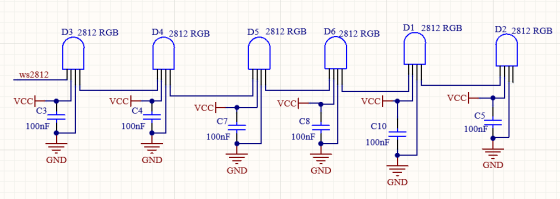
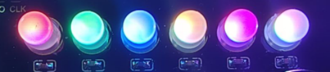

### Project 5 Rainbow Ambient Light

**1. Description**

Arduino 2812RGB LED is a programable colorful dreamy light, whose color, brightness and rhythm are adjustable. This rainbow ambient light can be used as a dynamic decoration at will. Or you may control it to "dance with music". Importantly, it can be improved as an alarm. Its built-in sensor detects the ambient surroundings to warn users by changing its color, brightness and rhythm.

**2. Working Principle**



The data protocol adopts communication mode of single-line return-to-zero code. After the pixel is reset on power, DIN terminal receives data from the controller. The firstly arriving 24bit data will be extracted by the first pixel and be sent to the inner data register. 

Remaining data will be amplified by an amplification circuit and be transmitted through DOUT port to the next cascaded pixel. Being transmitted through pixels, the signal decreases 24bit each time. 

Besides, The pixel adopts automatic shaping and forwarding technology, insomuch that the cascade number of the pixel is only limited by the signal transmission speed.

**3. Wiring Diagram**


**4. Test Code**

```
/*
  keyestudio ESP32 Inventor Learning Kit 
  Project 5.1  Rainbow Ambient Light
  http://www.keyestudio.com
*/
//Add 2812RGB library file
#include <NeoPixel_ESP32.h>
#define PIN 15

Adafruit_NeoPixel strip = Adafruit_NeoPixel(6, PIN);  //Defines the instance strip and assigns the RGB LED number pins to the library code

void setup() 
{
  strip.begin();        //Activate RGB LED
  strip.show(); // Refresh the display
}

void loop() 
{
  strip.setPixelColor(0, strip.Color(255, 0, 0));       //The frist RGB LED is red 
  strip.setPixelColor(1, strip.Color(0, 255, 0));       //The second RGB LED is green  
  strip.setPixelColor(2, strip.Color(0, 0, 255));       //The third RGB LED is blue 
  strip.setPixelColor(3, strip.Color(255, 255, 0));     //The fourth RGB LED is yellow 
  strip.setPixelColor(4, strip.Color(255, 0, 255));     //The fifth RGB LED is purple 
  strip.setPixelColor(5, strip.Color(255, 255, 255));   //The sixth RGB LED is white 
  strip.show();       //Refresh the display
  delay(100);         //Give a delay to save the stability of the display
}
```

**5. Test Result**

After uploading the code and powering on, the LED will light up in different colors.

From left to right：

- The first RGB LED is red 
- The second RGB LED is green  
- The third RGB LED is blue 
-  The fourth RGB LED is yellow 
- The fifth RGB LED is purple 
- The sixth RGB LED is white 



**6. Extended Code**

```
/*
  keyestudio ESP32 Inventor Learning Kit  
  Project 5.2  Rainbow Ambient Light
  http://www.keyestudio.com
*/
//Add 2812RGB library file
#include <NeoPixel_ESP32.h>
#define PIN 15
Adafruit_NeoPixel strip = Adafruit_NeoPixel(6, PIN, NEO_GRB + NEO_KHZ800);

void setup() 
{
  strip.begin();
  strip.show(); // Initialize all pixels to 'off'
}

void loop() 
{
  // Some example procedures showing how to display to the pixels:
  colorWipe(strip.Color(255, 0, 0), 50); // Red
  colorWipe(strip.Color(0, 255, 0), 50); // Green
  colorWipe(strip.Color(0, 0, 255), 50); // Blue
  // Send a theater pixel chase in...
  theaterChase(strip.Color(127, 127, 127), 50); // White
  theaterChase(strip.Color(127,   0,   0), 50); // Red
  theaterChase(strip.Color(  0,   0, 127), 50); // Blue

  rainbow(20);
  rainbowCycle(20);
  theaterChaseRainbow(50);
}

// Fill the dots one after the other with a color
void colorWipe(uint32_t c, uint8_t wait) 
{
  for(uint16_t i=0; i<strip.numPixels(); i++) 
  {
      strip.setPixelColor(i, c);
      strip.show();
      delay(wait);
  }
}

void rainbow(uint8_t wait) 
{
  uint16_t i, j;

  for(j=0; j<256; j++) 
  {
    for(i=0; i<strip.numPixels(); i++) 
    {
      strip.setPixelColor(i, Wheel((i+j) & 255));
    }
    strip.show();
    delay(wait);
  }
}

// Slightly different, this makes the rainbow equally distributed throughout
void rainbowCycle(uint8_t wait) 
{
  uint16_t i, j;
  for(j=0; j<256*5; j++) // 5 cycles of all colors on wheel
  { 
    for(i=0; i< strip.numPixels(); i++) 
    {
      strip.setPixelColor(i, Wheel(((i * 256 / strip.numPixels()) + j) & 255));
    }
    strip.show();
    delay(wait);
  }
}

//Theatre-style crawling lights.
void theaterChase(uint32_t c, uint8_t wait) 
{
  for (int j=0; j<10; j++) //do 10 cycles of chasing
  {  
    for (int q=0; q < 3; q++) 
    {
      for (int i=0; i < strip.numPixels(); i=i+3) 
      {
        strip.setPixelColor(i+q, c);    //turn every third pixel on
      }
      strip.show();
      delay(wait);
      for (int i=0; i < strip.numPixels(); i=i+3) 
      {
        strip.setPixelColor(i+q, 0);        //turn every third pixel off
      }
    }
  }
}

//Theatre-style crawling lights with rainbow effect
void theaterChaseRainbow(uint8_t wait) 
{
  for (int j=0; j < 256; j++) // cycle all 256 colors in the wheel
  {     
    for (int q=0; q < 3; q++) 
    {
        for (int i=0; i < strip.numPixels(); i=i+3) 
        {
          strip.setPixelColor(i+q, Wheel( (i+j) % 255));    //turn every third pixel on
        }
        strip.show();
        delay(wait);
        for (int i=0; i < strip.numPixels(); i=i+3) 
        {
          strip.setPixelColor(i+q, 0);        //turn every third pixel off
        }
    }
  }
}

// Input a value 0 to 255 to get a color value.
// The colours are a transition r - g - b - back to r.
uint32_t Wheel(byte WheelPos) 
{
  if(WheelPos < 85) 
  {
  	return strip.Color(WheelPos * 3, 255 - WheelPos * 3, 0);
  } 
  else if(WheelPos < 170) 
  {
      WheelPos -= 85;
      return strip.Color(255 - WheelPos * 3, 0, WheelPos * 3);
  } 
  else 
  {
      WheelPos -= 170;
      return strip.Color(0, WheelPos * 3, 255 - WheelPos * 3);
  }
}
```

**7. Test Result**

After uploading the code and powering on, the LED will light up in different colors and make a light show.

