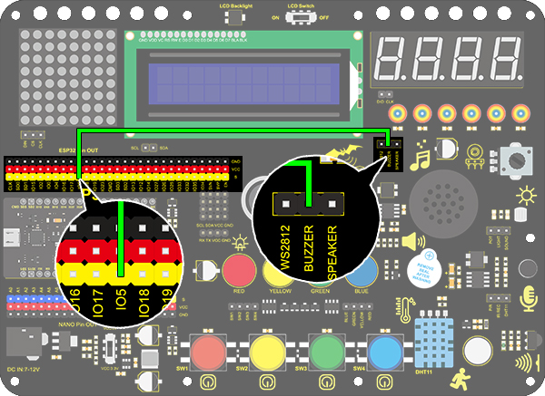

### Project 7 Active Buzzer

**1.Description**

An active buzzer is a component used as an alarm, a reminder or an entertaining device, which boasts a reliable sound.What's more, it empowers to stimulate highly controllable sounds, making our projects more interesting.

**2. Working Principle**


An active buzzer integrates a multi-vibrator, so it makes sound only via DC voltage. Pin 1 of the buzzer connects to VCC and pin 2 is controlled by a triode. When a high level is provided for the base (pin 1) of the triode, its collector (pin 3) and emitter (pin 2) link to GND, and then the buzzer emits sound. 

Oppositely, if we offer a low level to the base, the rest of pins will be disconnected, so the buzzer will remain quiet.

**3. Wiring Diagram**



**4. Test Code**

```
 /*
  keyestudio ESP32 Inventor Learning Kit
  Project 7 Active Buzzer
  http://www.keyestudio.com
*/
int buzzer = 5; //Define buzzer connected to IO5 pin 

void setup() 
{
  pinMode(buzzer, OUTPUT);//Set the output mode 
}

void loop() 
{
  digitalWrite(buzzer, HIGH); //IO5 pin outputs a high level to cause the buzzer to emit sound 
  delay(1000);					//Delay 1000ms
  digitalWrite(buzzer, LOW); //IO5 outputs a low level to prevent the buzzer to emit sound 
  delay(1000);
}
```

**5. Test Result**

After uploading code and powering on, the buzzer emits sound for 1s and stays quiet for 1s. 