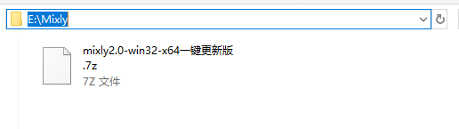
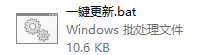
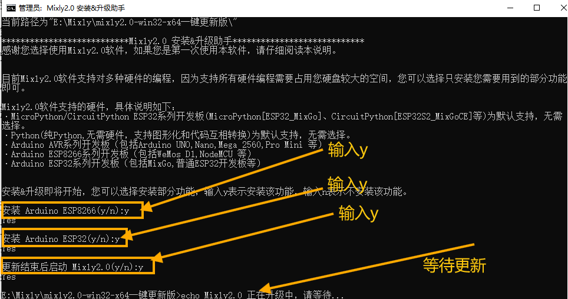
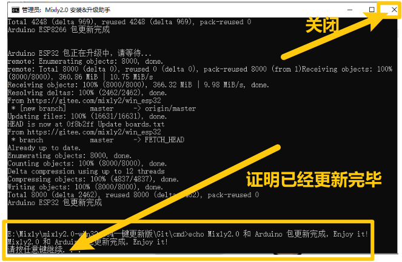
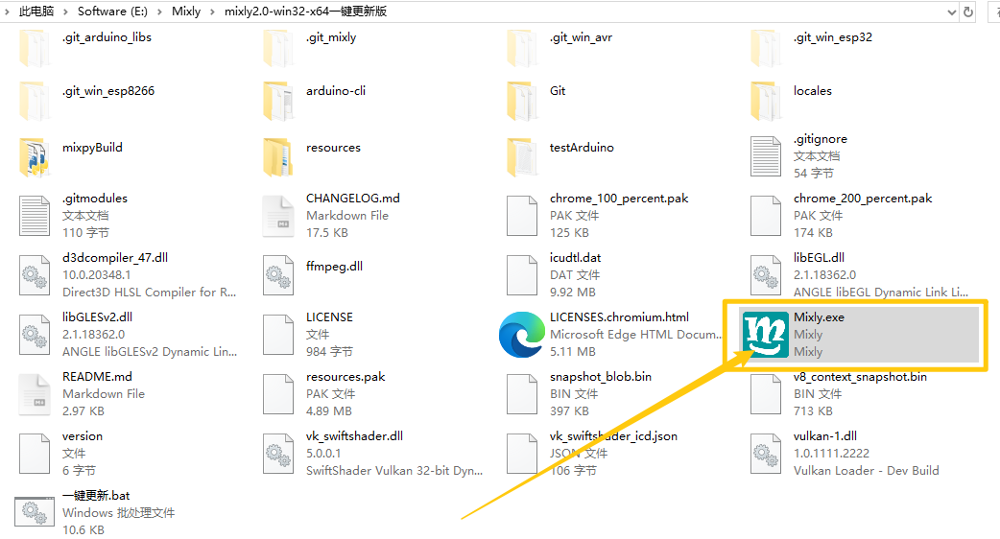
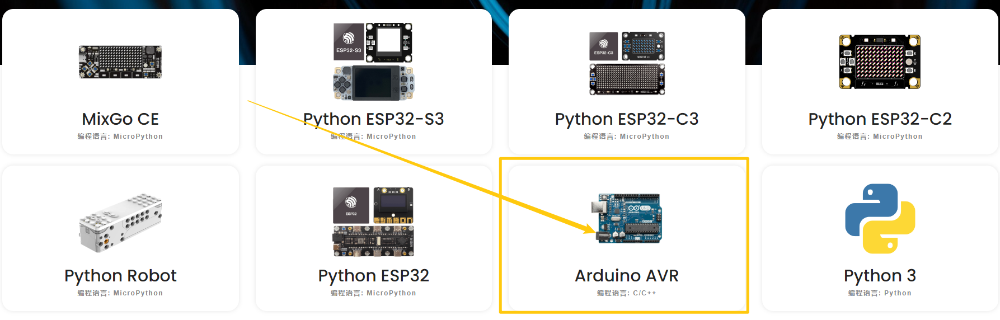
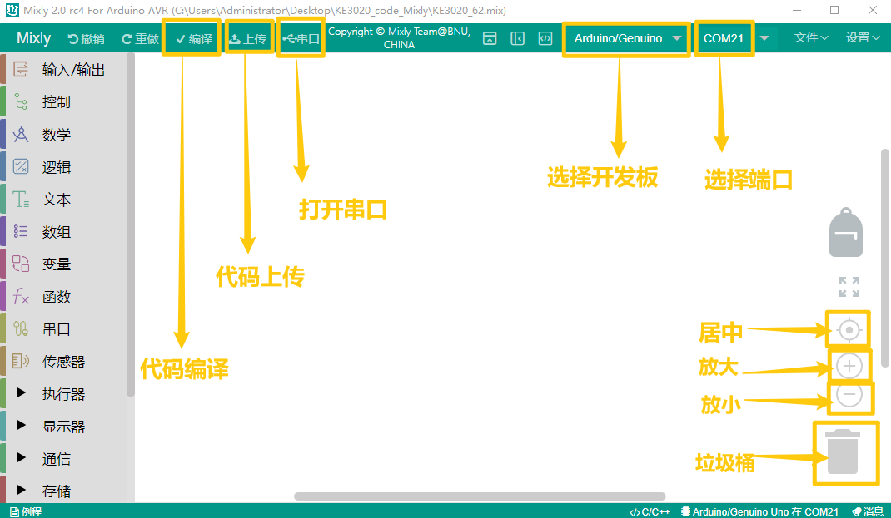
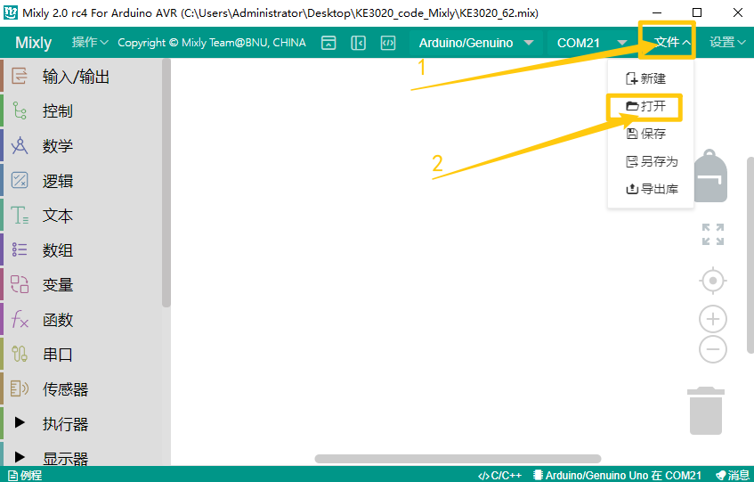
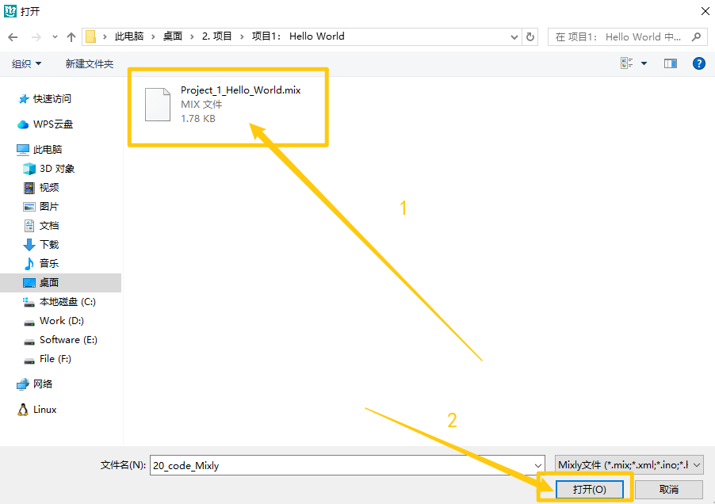
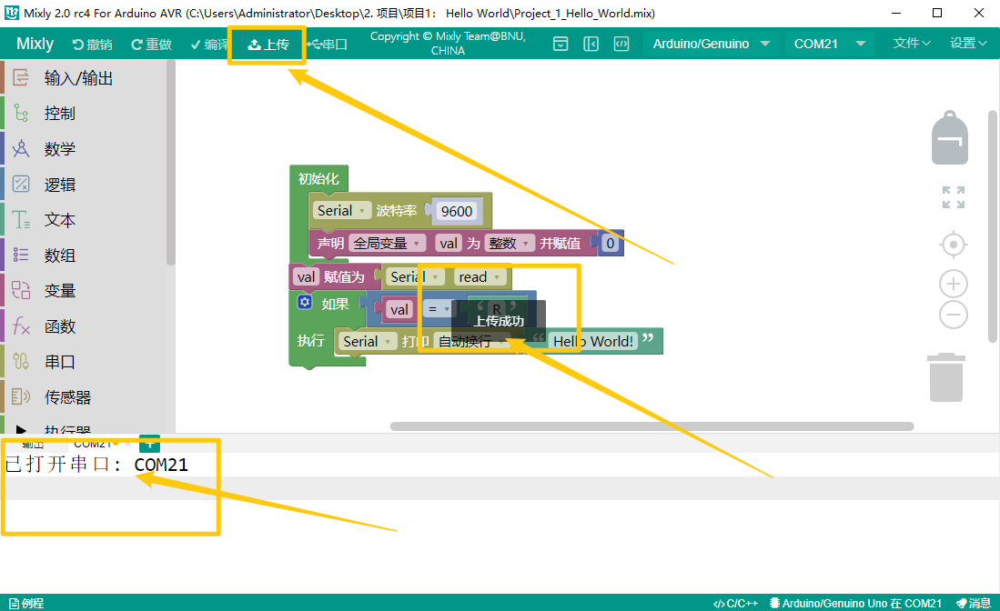

# 3. Mixly

## 3.1 资料下载

代码下载：[Mixly](./Mixly.7z)

软件下载: 

- Windows系统：https://pan.baidu.com/s/1YjYgnbvYammvPTdFuFwb8g?pwd=keye
- Mac系统： https://pan.baidu.com/s/127Qc_neXv4Mv27H4KP3DPg?pwd=keye
- Liunx系统：https://pan.baidu.com/s/1HnrFu7Hke4LRn3R0gAKBjw?pwd=keye

## 3.2 软件安装

1. 下载压缩包，压缩包存放路径不要有中文

2. 解压压缩包，打开文件夹，打开。

3. 需要输入的地方全部输入“y”，等待更新即可。

4. 更新完毕后，关闭。

   

5.再次打开文件夹，可以看到软件已存在，点击打开。

## 3.3 软件介绍

1. 打开软件后，选择“Arduino AVR”.

2. 工具栏介绍

   

## 3.4 上传代码文件

1. 点击“文件”---->“打开”

2. 找到代码保存的位置，选择“.mix”文件，点击“确定”

3. 点击“上传”。

   

## 3.5 项目

**单个传感器/模块实验课程**

拿到套件后，套件中有42款传感器/模块，有对应的keyes UNO R3开发板、传感器扩展板和连接线。这里，我们将42款传感器/模块利用自带连接线，单独连接在keyes UNO R3开发板和传感器扩展板。然后上传对应的测试代码，单独测试各个传感器/模块的功能。

特别注意：实验时，模块/传感器连接线材时，必须按照资料里的接线方法及位置，电源与信息脚不能错接，否则会损坏模块/传感器。

**传感器/模块组合实验课程**

前面课程中，单独测试了传感器/模块的功能，功能比较单一。在此，可以将多个传感器/模块搭配使用，组合出各种各样的功能。传感器/模块种类比较多，以下选择几款比较经典的组合实验。也可以根据自己的想法，自己设置代码，组合出你想要的特别的功能。

