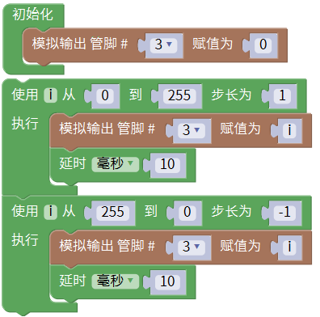

### 项目一 LED 模块测试

**1.实验说明**

在这个套件中，有一个keyes brick LED白发白模块。它的控制方法非常简单，控制时，GND VCC上电后；信号端S为高电平时LED亮起，S为低电平时LED熄灭。

实验中，提供两个测试代码，分别控制LED模块上实现闪烁和呼吸灯的效果。闪烁效果好理解；呼吸灯效果，就是控制LED模块上LED首先逐渐变亮，然后逐渐变暗，循环交替，如人体呼吸一样。

**2.实验器材**

- keyes brick LED白发白模块*1

- keyes UNO R3开发板*1

- 传感器扩展板*1

- 3P 双头XH2.54连接线*1

- USB线*1

**3.接线图**

**4.测试代码**

代码1：

代码2：

**5.代码1说明**

1. 代码1中从界面中找到。
2. 中，管脚是指模块信号端连接的接口，通过接线图，方向模块信号端连接在D3，因此，代码中把管脚设置为3。是指，可以将模块信号端S设置为高低电平。测试的过程中，当模块S端设为高电平（高）时，模块上LED亮起，设为低电平（低)时，模块上LED熄灭。
3. 代码中代码延迟时间，单位毫秒，代表延迟1000毫秒，即1秒。
4. 在米思齐软件中，只要没有单元，就代表代码中所有设置都是循环的。
5. 代码中第一条把模块信号端接到D3，设置为高电平，就是点亮模块上LED；第二条延迟1000毫秒，就是让模块上LED点亮1秒。同样第三条第四条代码表示让模块上LED熄灭1秒。代码默认循环，也就是控制模块上LED，循环亮1秒，灭1秒，实现闪烁效果。通过代码设置，可以更改模块上LED亮灭的延迟时间，从而使模块上LED实现不同的闪烁效果。

**6.代码2说明**

1. 代码中，用到了代码改单元中的代码设置只执行1次，然后后面的代码就一直是循环的了。

2. 代码1中，控制模块上信号端控制LED亮灭。在代码2中，通过利用keyes UNO R3开发板上PWM口，设置PWM值，控制模块上LED亮度。
3. keyes UNO R3开发板上只有D3 D5 D6 D9 D10  D11数字口是PWM口，如果要控制LED的亮度，信号端就只能接着几个接口。实验中，将模块信号端接在D3脚，属于PWM口。设置时，设置PWM数值越小，模块上LED越暗，数值越大，模块上LED越亮，范围为0-255。
4. ，初始化时，将D3的PWM数值设置为0，即熄灭模块上的LED。
5. 代表设置一个变量i，i从0直接增加到255，每一次都加1，总共加了255次。
6. 代表将D3的PWM值设置为i，代表延迟10毫秒；和前面代码搭配，代表每过10毫秒，变量i都加1，直到i为255。
7. 代表设置一个变量i，i从255直接减小到0，每一次都加-1，总共加了255次。
8. 初始时将D3端设置为0，熄灭模块上LED。然后开始循环，将D3的PWM值设置为i，i刚开始由0增加到255，每次加1，每加一次延迟10毫秒，模块上LED逐渐变亮。PWM为255后，i开始由255减小到0，每次减1，每减一次延迟10毫秒，模块上LED逐渐变暗。然后又逐渐变亮，循环交替，如人体呼吸一样。
9. 如果感觉逐渐变亮或者逐渐变暗的时间过长，可以更改代码设置。有两种方法，一种是将每次加1减1的延迟时间降低；另一种是更改步长，注意这个步长必须能被255整除，如3    5。步长改为3 -3代表i每次增加3或减小3。

