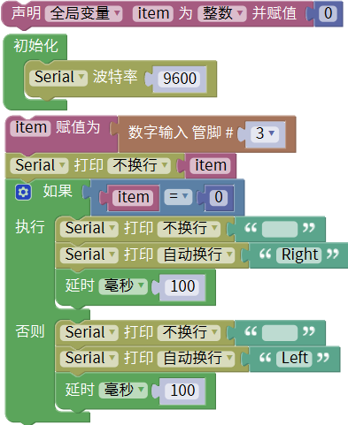
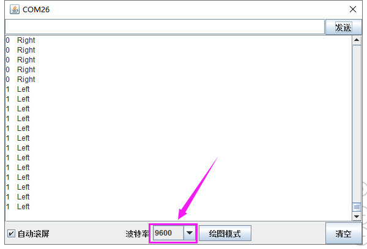

### 项目十一 左右倾斜检测

**1.实验说明**

在这个套件中，有一个keyes brick 倾斜模块传感器，它主要采用SW-200D振动开关元件。SW-200D振动开关元件是滚珠型倾斜感应单方向性触发开关。该振动开关两端一端镀金，一端镀银；镀金端为触发端，镀银端为导电端。当传感器在水平位置或向导电端（镀银）倾斜时，开关元件为开路OFF状态，传感器信号端输出高电平；当传感器向触发端（镀金）倾斜时，开关元件为闭路ON状态，传感器信号端输出低电平。

实验中，通过读取模块上S端高低电平，判断传感器倾斜的方向；并且在串口监视器上显示测试结果。

**2.实验器材**

- keyes brick 倾斜模块传感器*1

- keyes UNO R3开发板*1

- 传感器扩展板*1

- 3P双头XH2.54连接线*1

- USB线*1

**3.接线图**

**4.测试代码**

**5.代码说明**

在单元内，找到以下元件。

**6.测试结果**

上传测试代码成功，利用USB线上电后，打开串口监视器，设置波特率为9600。串口监视器显示对应数据和字符。实验中，手握传感器白色接口，当传感器向右倾斜时，item为0，串口监视器显示“Right”字符；当传感器向左倾斜时，item为1，串口监视器显示“Left”字符，如下图。

