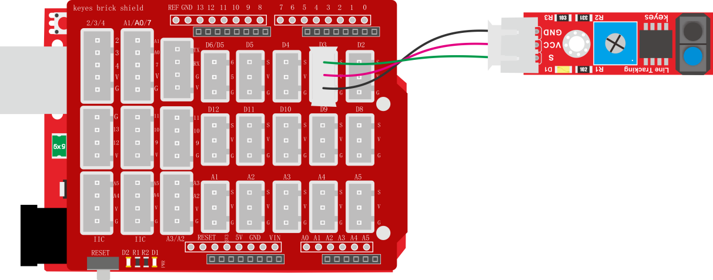
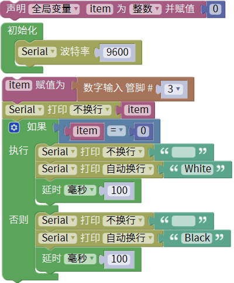
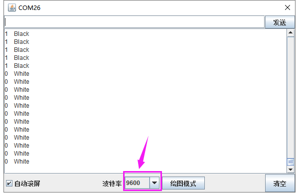

### 项目十四 巡线传感器检测黑白线

**1.实验说明**

在这个套件中，有一个keyes brick 巡线传感器，它主要采用1个TCRT5000 反射型黑白线识别传感器元件。传感器的原理是利用红外线对颜色的反射率不一样，将反射信号的强弱转化成电流信号。传感器没有检测到物体或者检测到黑色物体时，信号端为高电平；检测到白色物体时，信号端为低电平；它的检测高度为0—3cm。我们可以通过旋转传感器上电位器，调节灵敏度，即调节检测高度。当旋转电位器，是传感器上D1 LED介于不亮与亮之间的临界点时，灵敏度最好。

实验中，通过读取模块上S端高低电平，判断传感器检测到的物体颜色（黑白）；并且在串口监视器上显示测试结果。

**2.实验器材**

- keyes brick巡线传感器*1

- keyes UNO R3开发板*1

- 传感器扩展板*1

- 3P双头XH2.54连接线*1

- USB线*1

**3.接线图**

**4.测试代码**

**5.代码说明**

在单元内，找到以下元件。

**6.测试结果**

上传测试代码成功，利用USB线上电后，打开串口监视器，设置波特率为9600。串口监视器显示对应数据和字符。实验中，当传感器没有检测到物体或者检测到黑色物体时，item为1，串口监视器显示“Black”字符；检测到白色物体（能够反光）时，item为0，串口监视器显示“White”字符，如下图。

