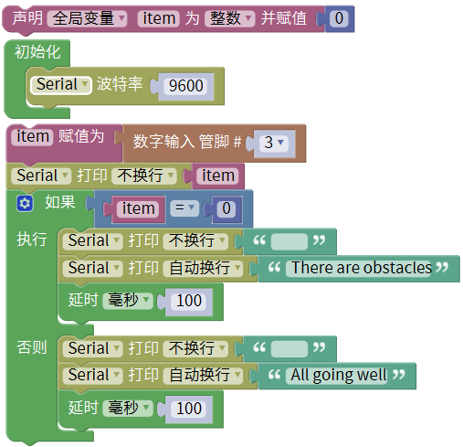
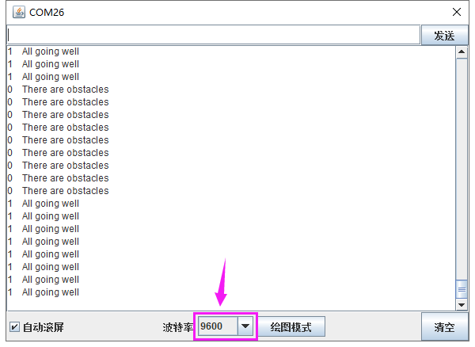

### 项目十五 避障传感器检测障碍物

**1.实验说明**

在这个套件中，有一个keyes brick避障传感器，它主要采用一对红外线发射与接收管元件。原理就是发射管发射出一定频率的红外线，当检测方向遇到障碍物（反射面）时，红外线反射回来被接收管接收，此时指示灯亮起，经过电路处理后，信号输出接口输出数字信号。传感器上有两个电位器，一个用于调节发送功率，一个用于调节接收频率，通过调节2个电位器，可以调节它的有效距离。

实验中，通过读取传感器上S端高低电平，判断是否存在障碍物；并且在串口监视器上显示测试结果。

**2.实验器材**

- keyes brick避障传感器*1

- keyes UNO R3开发板*1

- 传感器扩展板*1

- 3P双头XH2.54连接线*1

- USB线*1

**3.接线图**

**4.测试代码**

**5.代码说明**

在单元内，找到以下元件。

**特别注意**

烧录好测试代码，按照接线图连接好线，上电后，我们开始调节两个电位器调节感应距离。

1. 调节发射功率调节电位器，先将电位器顺时针到尽头，然后回调一些，使传感器上D1 LED介于不亮与亮之间的零界点。

2. 调节接收频率调节电位器，顺时针调节时，频率增大。调节使它产生38KHz频率的方波，调节时，也观察传感器上D1 LED，使它介于不亮与亮之间的零界点。

**测试结果**

上传测试代码成功，利用USB线上电后，打开串口监视器，设置波特率为9600。串口监视器显示对应数据和字符。实验中，当传感器检测到障碍物时，item为0，串口监视器显示“There are obstacles”字符；没有检测到障碍物时，item为1，串口监视器显示“All going well”字符，如下图。

