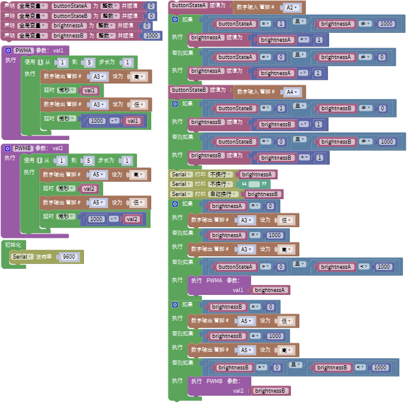
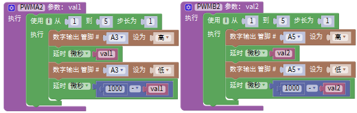
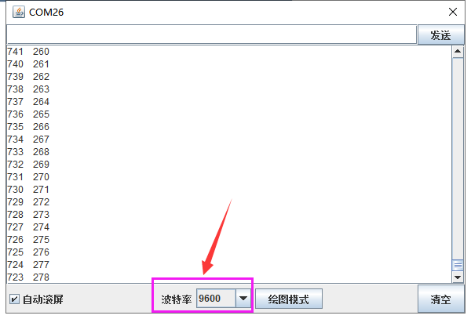

### 项目十六 魔术光杯传感器

**1.实验说明**

在这个套件中，有两个keyes brick魔术光杯传感器，它的原理是利用PWM调光的原理，两个传感器的亮度发生变化。滚珠开关提供数字信号，触发PWM的调节，通过程序的设计，可以看到类似于两组装满光的杯子倒来倒去的效果了。

实验中，通过读取传感器上S端高低电平，判断传感器的倾斜方向，然后控制传感器上LED的亮度变化（调节L端的PWM值）。

**2.实验器材**

- keyes brick魔术光杯传感器\*2

- keyes UNO R3开发板*1

- 传感器扩展板*1

- 4P双头XH2.54连接线\*2

- USB线*1

**3.接线图**

**4.测试代码**

**5.代码说明**

1. 下面是设置子程序，模拟PWM口的PWM值。设置时，设置方波，设置高低电平延迟时间总共为1000微妙，即周期为1秒，频率是1000Hz。设置是PWM值就相当于设置方波时高电平的延迟时间（val1和val2）。

2. 设置程序逻辑如下表格

| 条件                                                    | 设置                                              |
| ------------------------------------------------------- | ------------------------------------------------- |
| 数字口A2（buttonStateA）为高电平并且brightnessA不是1000 | brightnessA设置为brightnessA加1（最大1000）       |
| 数字口A2（buttonStateA）为低电平并且brightnessA不是0    | brightnessA设置为brightnessA减1（最小0）          |
| 数字口A4（buttonStateB）为高电平并且brightnesB不是0     | brightnessB设置为brightnessB减1（最小0）          |
| 数字口A4（buttonStateB）为低电平并且brightnessB不是1000 | brightnessB设置为brightnessB加1（最大1000）       |
| brightnessA为0                                          | 设置数字口A3为低电平                              |
| brightnessA为1000                                       | 设置数字口A3为高电平                              |
| brightnessA大于0且小于1000                              | 利用数字口A3模拟PWM口，设置A3的PWM值为brightnessA |
| brightnessB为0                                          | 设置数字口A5为低电平                              |
| brightnessB为1000                                       | 设置数字口A5为高电平                              |
| brightnessB大于0且小于1000                              | 利用数字口A5模拟PWM口，设置A5的PWM值为brightnessB |

**6.测试结果**

上传测试代码成功，利用USB线上电后，打开串口监视器，设置波特率为9600。将两个魔术光杯传感器同时倾斜一边，一个魔术光杯上的LED逐渐变暗，同时另一个逐渐变亮，最终一个LED完全熄灭，一个LED最亮；在串口监视器中看到对应具体数值变化，如下图。当倾斜另一边中，现象一样，方向相反。

