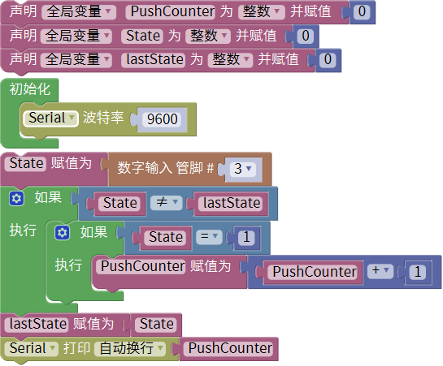
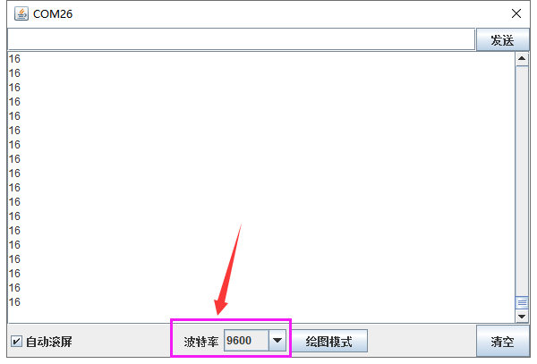

### 项目十七 光折断计数

**1.实验说明**

这个套件中包含一个 keyes brick光折断传感器，它主要采用1个ITR-9608光电开关。它属于对射遮断式光电开关光学开关传感器。当用纸片挡住传感器凹槽后，传感器信号端为高电平，自带D1 LED熄灭；否则传感器信号端为低电平，自带D1 LED亮起。

在这里，通过检测传感器信号端高低电平，通过代码设置，模拟出流水线上利用类似传感器，对产品进行计数。

**2.实验器材**

- keyes brick光折断传感器*1

- keyes UNO R3开发板*1

- 传感器扩展板*1

- 3P双头XH2.54连接线*1

- USB线*1

**3.接线图**

**4.测试代码**

**5.代码说明**

1. 在库文件的单元内，找到以下元件。

2. 通过以下表格，可以了解这个代码的逻辑设置。

| 初始设置                               | PushCounter设置为0（累计通过物体数目） State设置为0（传感信号端数值） lastState设置为0（传感器信号端上一循环数值） |                                 |
| -------------------------------------- | ------------------------------------------------------------ | ------------------------------- |
| 当物体开始穿过传感器凹槽时（一瞬间）   | State检测到变为1，lastState为0，两个数据不相等。             | PushCounter设置为PushCounter加1 |
| 当物体穿过传感器凹槽过程中（循环）     | State检测到变为1，lastState设置为1，两个数据相等。           | PushCounter不变                 |
| 当物体刚穿过传感器凹槽过程中（一瞬间） | State检测到变为0，lastState设置为1，两个数据不相等。         | PushCounter不变                 |
| 当物体完全穿过传感器凹槽后（循环）     | State检测到变为0，lastState设置为0，两个数据相等。           | PushCounter不变                 |

测试结果

上传测试代码成功，按照接线图接好线，利用USB上电后，打开串口监视器，设置波特率为9600；串口监视器显示PushCounter数据，每个物体穿过传感器凹槽，PushCounter数据不断加1。

