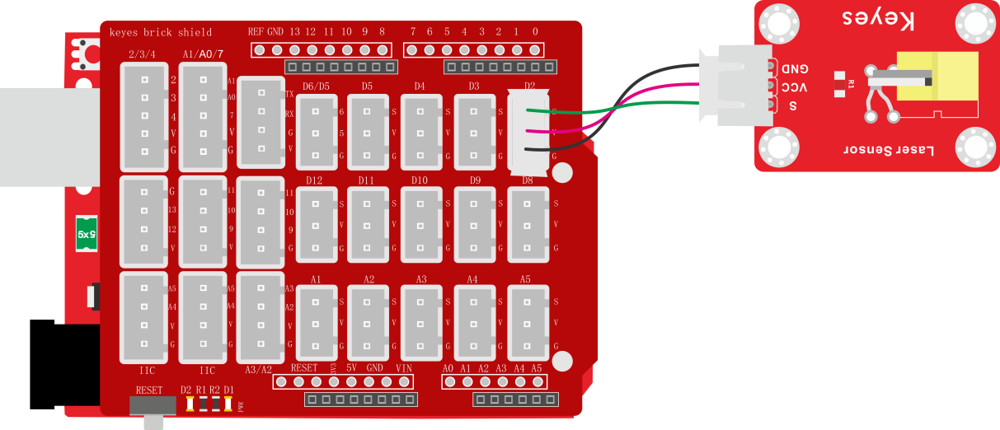
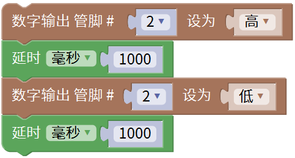

### 项目二 激光头传感器模块发出激光

**1.实验说明**

在这个套件中，包含一个激光头传感器模块。它主要由1个铜材半导体激光管元件组成。控制时，需要在模块S端输入高电平信号，模块开始工作，激光管发射出红色激光信号。

实验中，控制这个模块上激光管循环发射红色激光信号。

**2.实验器材**

- keyes brick 激光头传感器模块*1

- keyes UNO R3开发板*1

- 传感器扩展板*1

- 3P双头XH2.54连接线*1

- USB线*1

**3.接线图**

**4.测试代码**

1. 在实验中，在单元内，找到以下模块。

2. 把管脚设置为2，设置为高时，模块上激光管发射出红色激光信号；设置为低时，模块上激光管不发射出红色激光信号。

**5.测试结果**

上传测试代码成功，上电后，模块上激光管发射红色激光信号1秒，停止发射红色激光信号1秒，循环交替。