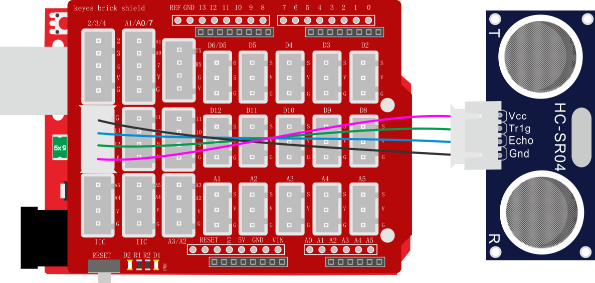
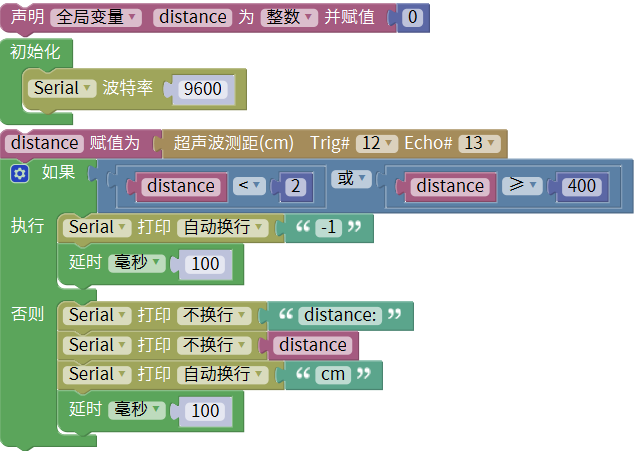
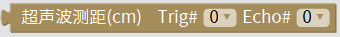
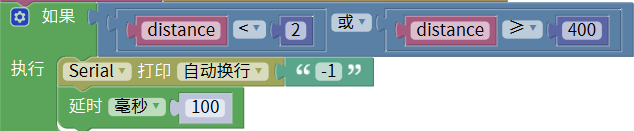
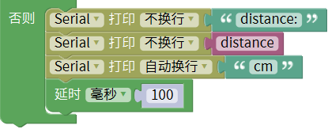
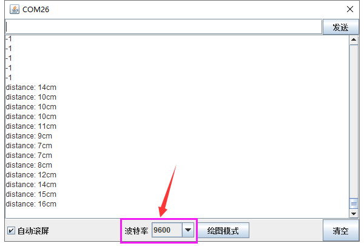

### 项目二十 超声波测距

**1.实验说明**

在这个套件中，有一个HC-SR04超声波传感器，它可以检测前方是否存在障碍物，并且检测出传感器与障碍物的详细距离。它的原理和蝙蝠飞行的原理一样，就是超声波模块发送出一种频率很高，人体无法听到的超声波信号。这些超声波的信号若是碰到障碍物，就会立刻反射回来，在接收到返回的信息之后，通过判断发射信号和接收信号的时间差，计算出传感器和障碍物的距离。

实验中，利用传感器检测传感器和障碍物之间的距离，将测试结果在串口监视器上显示。

**2.实验器材**

- keyes brick HC-SR04超声波传感器*1

- keyes UNO R3开发板*1

- 传感器扩展板*1

- 4P 双头XH2.54连接线*1

- USB线*1

**3.接线图**

 

**4.测试代码**

**5.代码说明**

1. 在。根据接线，将Trig设置为12，Echo设置为13。
2. HC-SR04超声波传感器最大测试距离为3-4m，最小测试距离为2cm。设置代码当检测距离小于2cm或者大于等于400cm时，串口监视器显示-1。

3. 在电脑的串口监视器中显示除传感器和障碍物之间的距离。

**6.测试结果**

上传测试代码成功，利用USB线上电后，打开串口监视器，设置波特率为9600。如果障碍物在测试范围外，串口监视器显示“-1”；否则，串口监视器显示超声波传感器和前方障碍物之间的距离，单位为cm，如下图。

